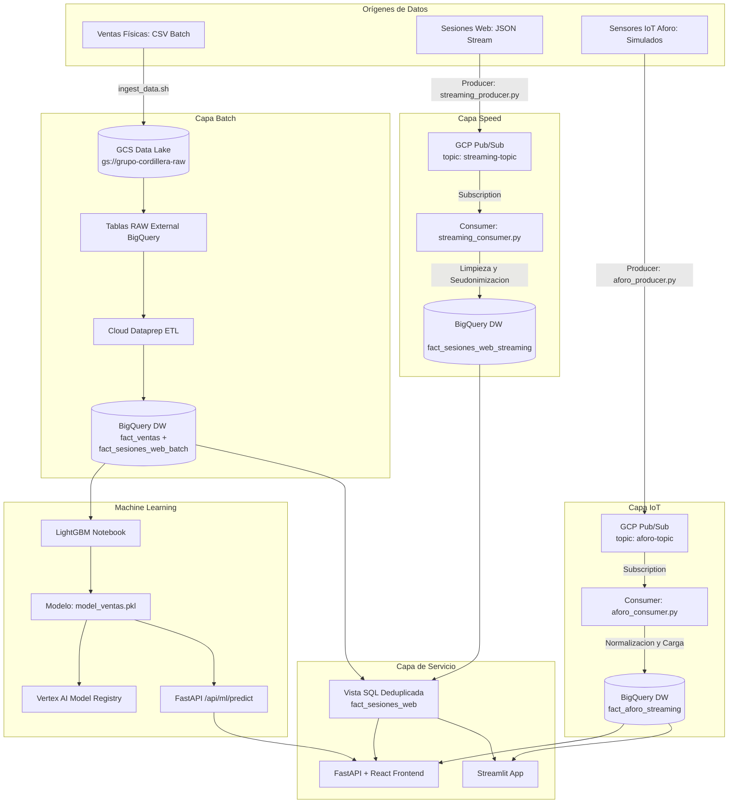
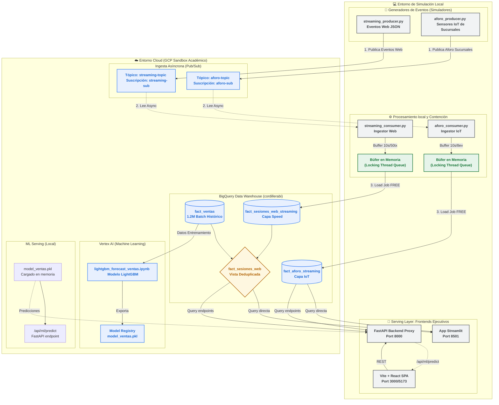

<style>
p { text-align: justify; text-justify: inter-word; } li { text-align: justify; }
</style>

<div align="justify">

# INFORME TÉCNICO: ARQUITECTURA LAMBDA (BATCH & REAL-TIME STREAMING)

## GRUPO CORDILLERA — EVALUACIÓN SUMATIVA N° 3

**Asignatura:** Big Data (AVY1101) **Duoc UC — Escuela de Informática y Telecomunicaciones**

---

### PORTADA

* **Integrante:** Héctor Águila V.
* **Sección:** `Big Data_003V`
* **Docente:** `Giocrisrai Godoi`
* **Fecha de Entrega:** 26 de Junio de 2026

---

## ÍNDICE

1. **Introducción**
2. **Justificación de la Arquitectura (Pilares de las 5Vs de Big Data)**
3. **Diseño de la Arquitectura Lambda Unificada y MLOps**
   * 3.1. Capa Batch (Procesamiento Histórico por Lotes)
   * 3.2. Capa Speed (Procesamiento en Tiempo Real / Streaming)
   * 3.3. Capa IoT (Sensores de Aforo en Tiendas)
   * 3.4. Capa de Servicio (Serving Layer)
   * 3.5. Capa Operativa de MLOps con Vertex AI
   * 3.6. Arquitectura Híbrida de Simulación y Contención (GCP Sandbox Bypass)
4. **Implementación Técnica de la Capa Speed (Streaming Pipeline)**
   * 4.1. Ingesta en Línea mediante Cloud Pub/Sub (API Ingesta)
   * 4.2. Ingestor y Consumidor en Python (Limpieza, Seudonimización y Carga)
   * 4.3. Control de Ejecución (PID File Locking) y Registro de Actividad (Log de Auditoría)
   * 4.4. Capa IoT: Sensores de Aforo en Tiempo Real
5. **Capa de Servicio (Serving Layer) y Deduplicación de Datos**
   * 5.1. Esquema de Tablas Físicas en BigQuery
   * 5.2. Vista SQL Unificada de Consumo
6. **Gobierno de Datos, Privacidad y Cumplimiento (Ley N° 21.719)**
7. **Diseño del Panel de Control (Dashboards)**
   * 7.1. Dashboard Streamlit
   * 7.2. Frontend React + Vite
8. **Validación del Pipeline y Ejecución del Simulador**
9. **Machine Learning: Pronóstico de Ventas con LightGBM**
10. **Origen de Datos, Desafíos de Realismo y Conflictos de Simulación**
11. **Diferencias entre la Propuesta de Diseño y la Implementación Final**
12. **Conclusiones**

---

## 1. Introducción

El presente informe técnico expone la consolidación de la **Arquitectura Lambda** unificada para el **Grupo Cordillera**. Tras implementar el pipeline batch en la etapa previa, esta fase aborda el desarrollo físico de la **Capa Speed (Tiempo Real)** para capturar, transformar y analizar de manera continua los logs de navegación web (sesiones) en su e-commerce, integrándolos de forma nativa y sin duplicados con la carga histórica.

La solución cumple con las exigencias normativas chilenas de protección de datos personales (**Ley N° 21.719**) mediante técnicas de seudonimización y anonimización de IP implementadas en el flujo de ingesta. Asimismo, documenta las decisiones de ingeniería tomadas para eludir de manera costo-eficiente las restricciones operacionales de la nube en entornos de prueba (**GCP Sandbox**), logrando una simulación interactiva robusta, automatizada y auditable.

---

## 2. Justificación de la Arquitectura (Pilares de las 5Vs de Big Data)

La coexistencia del canal físico tradicional y la interacción digital del Grupo Cordillera se justifica bajo los parámetros fundamentales de Big Data:

* **Volumen:** La base histórica cuenta con 1.2 millones de ventas y 300 mil sesiones. La capa de streaming añade flujos constantes que impactan el almacenamiento físico sin degradar el rendimiento analítico, soportado por la escalabilidad transparente de BigQuery.
* **Velocidad (Foco Ev3):** La detección de comportamiento de navegación y eventos de abandono del carrito exige una latencia de procesamiento inferior a los 5 segundos para que Marketing o Logística actúen en tiempo real.
* **Variedad:** Coexisten datos transaccionales estructurados (CSV) y eventos de navegación semi-estructurados en formato JSON (NDJSON) provenientes de la navegación web. Los datasets sintéticos fueron generados con asistencia de modelos de IA (Gemini, DeepSeek y Opus) para lograr distribuciones estadísticas realistas (Pareto, Zipf) y cohesión semántica en los datos de prueba.
* **Veracidad:** La limpieza analítica se ejecuta en tiempo real sobre el flujo web, corrigiendo timestamps mal formateados e ignorando logs incompletos antes de consolidar los registros en el Data Warehouse.
* **Valor:** La unión del histórico Batch y el tiempo real Streaming permite al negocio optimizar inventarios, estimar tasas de propensión de compra en la sesión activa y diseñar embudos de conversión dinámicos.

---

## 3. Diseño de la Arquitectura Lambda Unificada y MLOps

La solución adopta un patrón de **Arquitectura Lambda** híbrido diseñado en capas para conciliar latencia e inmutabilidad:



### 3.1. Capa Batch (Procesamiento Histórico por Lotes)

Procesa los datos históricos agregados. Se implementó usando **Cloud Storage** como Data Lake y recetas de **Cloud Dataprep** (que ejecutan jobs distribuidos de **Cloud Dataflow** sin servidor) cargando las tablas analíticas optimizadas en BigQuery.

### 3.2. Capa Speed (Procesamiento en Tiempo Real / Streaming)

Diseñada para procesar datos de navegación web con baja latencia. Los clicks del usuario ingresan a **GCP Pub/Sub**, se procesan por un script ingestor y se cargan casi en tiempo real en una tabla física en BigQuery.

### 3.3. Capa IoT (Sensores de Aforo en Tiendas)

Procesa datos de sensores de aforo simulados en las **30 sucursales físicas** de Grupo Cordillera, distribuidas en 4 zonas geográficas de Chile (Norte, Centro, Sur, Austral) abarcando desde Arica (XV Región) hasta Punta Arenas (XII Región). Cada sensor publica a **Pub/Sub** el conteo de personas que entran y salen, la capacidad máxima, la zona, la región administrativa y el porcentaje de ocupación actual. Un consumidor en Python escribe a la tabla `fact_aforo_streaming` en BigQuery para visualización en tiempo real con segmentación por zona climática y geográfica.

### 3.4. Capa de Servicio (Serving Layer)

Unifica las rutas lógicas Batch, Speed e IoT. Mediante vistas SQL en BigQuery se consolida la información, expuesta a través de un **dashboard Streamlit** y un **frontend React + Vite** con FastAPI como backend proxy.

### 3.5. Capa Operativa de MLOps con Vertex AI

Permite desplegar analítica avanzada sobre la arquitectura Lambda:

1. **Vertex AI Pipelines:** Automatiza el re-entrenamiento mensual de modelos de propensión de compra a partir de los datos históricos consolidados.
2. **Model Registry:** Gestiona el control de versiones y el ciclo de vida de los modelos.
3. **Feature Store:** Almacena atributos calculados (ticket promedio, categoría favorita) sirviéndolos a bajísima latencia para alimentar el scoring.
4. **Prediction Endpoints:** Expone endpoints online (para inferencia en tiempo real en la Capa Speed) y batch (para proyecciones logísticas en BigQuery).

### 3.6. Arquitectura Híbrida de Simulación y Contención (GCP Sandbox Bypass)

Para eludir las restricciones de facturación y cuotas del entorno GCP Sandbox (que bloquea los *Streaming Inserts* directos a BigQuery e impide levantar nodos de Cloud Dataflow), se diseñó un flujo híbrido que desacopla la mensajería en la nube de la ingesta física.

El siguiente diagrama detalla cómo se orquesta la simulación local de eventos (Web e IoT) y su inserción controlada mediante Load Jobs gratuitos:



Esta solución representa una decisión crítica de arquitectura: se delega la orquestación y el almacenamiento intermedio en memoria local, mientras que el transporte (Pub/Sub), almacenamiento analítico masivo (BigQuery) y modelamiento predictivo (Vertex AI) se mantienen en la nube de GCP.

---

## 4. Implementación Técnica de la Capa Speed (Streaming Pipeline)

### 4.1. Ingesta en Línea mediante Cloud Pub/Sub (API Ingesta)

Se configuró un bus de mensajería asíncrona robusto usando la CLI de Google Cloud:

* **Tópico:** `projects/cordillerabi/topics/streaming-topic` (Punto de entrada de logs).
* **Suscripción:** `projects/cordillerabi/subscriptions/streaming-subscription` (Cola de lectura).

El script [streaming_producer.py](file:///Users/user/Desktop/BigData/Unidad3/scripts/streaming_producer.py) simula la telemetría en tiempo real: lee secuencialmente el archivo `data/sesiones_web.json`, valida la estructura de cada objeto y los publica a la API de Pub/Sub con un retardo configurable.

### 4.2. Ingestor y Consumidor en Python (Limpieza, Seudonimización y Carga)

Debido a las limitaciones del **GCP Sandbox** (donde los *Streaming Inserts* directos (`insertAll`) y el almacenamiento en Cloud Storage están bloqueados por falta de facturación activa), se diseñó un consumidor en Python ([streaming_consumer.py](file:///Users/user/Desktop/BigData/Unidad3/scripts/streaming_consumer.py)) que ejecuta un patrón de **Micro-batching en Memoria**:

1. Escucha mensajes de la suscripción Pub/Sub de manera asíncrona.
2. **Normaliza el timestamp:** Convierte el formato ISO (`2024-06-01T14:30:00Z`) al formato de fecha SQL de BigQuery (`YYYY-MM-DD HH:MM:SS`).
3. **Seudonimiza el ID del cliente:** Oculta los dígitos centrales del RUT (`123XXXXXX-K`) para resguardar la identidad del cliente (Ley N° 21.719).
4. **Anonimiza la IP:** Reemplaza el último octeto por `.0` para proteger la privacidad de red.
5. **Micro-batching:** Almacena los registros limpios en una lista protegida por bloqueos de exclusión mutua (`threading.Lock`). Cada 10 segundos o 50 registros, realiza un **Load Job de BigQuery** (`load_table_from_json`) para subir los datos. Los Load Jobs son libres de costo y permitidos en el Sandbox, eludiendo la restricción.

### 4.3. Control de Ejecución (PID File Locking) y Registro de Actividad (Log de Auditoría)

Para evitar que ejecuciones múltiples del pipeline dupliquen logs de transacciones en la base de datos y saturación de memoria, se implementaron controles a nivel de proceso:

* **Control de Ejecución (PID Lock):** Al arrancar el productor o consumidor, verifica si existe el archivo de bloqueo (`data/streaming_producer.pid` / `data/streaming_consumer.pid`). Lee el ID de proceso (PID) anterior y comprueba si sigue corriendo en la memoria del sistema operativo. Si está activo, el proceso actual **se auto-bloquea de inmediato** y aborta la ejecución con un mensaje de alerta, garantizando consistencia.
* **Registro de Actividad (Log de Auditoría):** Todas las acciones de inicialización, detención y conteo de filas cargadas quedan documentadas con fecha y hora en el archivo local de auditoría [pipeline_execution.log](file:///Users/user/Desktop/BigData/data/pipeline_execution.log).

### 4.4. Capa IoT: Sensores de Aforo en Tiempo Real

Para complementar la telemetría web con datos del mundo físico, se diseñó una capa de sensores IoT que simula la ocupación en las **30 sucursales físicas** de Grupo Cordillera, distribuidas estratégicamente en 4 zonas geográficas:

| Zona     | Regiones                                          | Sucursales | Ejemplos                                      |
| :------- | :------------------------------------------------ | :--------- | :-------------------------------------------- |
| **Norte**   | XV, I, II, III, IV                                | 5          | Arica, Iquique, Antofagasta, Copiapó, La Serena |
| **Centro**  | V, RM, VI, VII                                    | 12         | Santiago, Viña del Mar, Rancagua, Talca       |
| **Sur**     | XVI, VIII, IX, XIV, X                             | 9          | Concepción, Temuco, Valdivia, Puerto Montt    |
| **Austral** | XI, XII                                           | 2          | Coyhaique, Punta Arenas                       |

* **Tópico Pub/Sub:** `projects/cordillerabi/topics/aforo-topic`.
* **Suscripción:** `projects/cordillerabi/subscriptions/aforo-subscription`.
* **Tabla destino:** `cordillerabi.grupo_cordillera_dw.fact_aforo_streaming`, particionada por día (campo `timestamp`), clusterizada por `id_sucursal`, con campos adicionales `zona` y `region` para segmentación geográfica.

El script [aforo_producer.py](file:///Users/user/Desktop/BigData/Unidad3/aforo/aforo_producer.py) simula la fluctuación de personas en cada tienda utilizando tres factores de ponderación:

1. **Factor horario (`factor_hora`):** Modela la concurrencia según la hora del día (peak 18-20h con 2.5x, valle nocturno 0-8h con 0.1x).
2. **Factor diario (`factor_dia`):** Fines de semana con 1.5x sobre la base laboral.
3. **Factor zonal (`factor_zona`):** Centro tiene mayor afluencia (1.0-1.2x), Sur y Austral menor (0.5-1.0x), reflejando la densidad poblacional y climática de Chile.

Cada 5 segundos publica un lote de 30 eventos (uno por sucursal) con coordenadas geográficas (lat/lng), capacidad máxima, aforo actual, flujo de entrada/salida, zona y región. El script [aforo_consumer.py](file:///Users/user/Desktop/BigData/Unidad3/aforo/aforo_consumer.py) sigue el patrón de micro-batching con Load Jobs para persistir los datos en BigQuery.

Este pipeline permite visualizar en el dashboard:

* **Ocupación en vivo** por sucursal con semáforo (verde < 50%, amarillo 50-80%, rojo > 80%).
* **Segmentación por zona geográfica:** Filtrado y agregación por Norte, Centro, Sur y Austral.
* **Mapa nacional interactivo** con las 30 sucursales geolocalizadas en el frontend React con Leaflet.
* **Insights climáticos:** La correlación entre zona y ocupación permite inferir impacto del clima en la afluencia a tiendas físicas.

---

## 5. Capa de Servicio (Serving Layer) y Deduplicación de Datos

### 5.1. Esquema de Tablas Físicas en BigQuery

Los datos estructurados y procesados se consolidan en el dataset `grupo_cordillera_dw` (región `us-central1`):

* **`fact_sesiones_web_batch`**: Tabla con la carga histórica (300k registros limpios en Dataprep).
* **`fact_sesiones_web_streaming`**: Tabla con los registros ingresados en vivo por el consumidor.

### 5.2. Vista SQL Unificada de Consumo

Para resolver la duplicidad de datos en tiempo real/streaming (cuando una re-ejecución del pipeline o una sesión solapada devuelve datos que ya existen en el batch histórico), se creó la vista lógica `fact_sesiones_web`.

```sql
CREATE OR REPLACE VIEW `cordillerabi.grupo_cordillera_dw.fact_sesiones_web` AS
WITH union_data AS (
  -- Datos Batch
  SELECT session_id, timestamp, ip_anonima, id_anonimo_cliente, event_type, sku_product, device, 'BATCH' as origen
  FROM `cordillerabi.grupo_cordillera_dw.fact_sesiones_web_batch`
  
  UNION ALL
  
  -- Datos Streaming
  SELECT session_id, timestamp, ip_anonima, id_anonimo_cliente, event_type, sku_product, device, 'STREAMING' as origen
  FROM `cordillerabi.grupo_cordillera_dw.fact_sesiones_web_streaming`
)
-- Deduplicación lógica priorizando registros batch (consolidados)
SELECT * EXCEPT(row_num, origen)
FROM (
  SELECT *,
         ROW_NUMBER() OVER(
           PARTITION BY session_id 
           ORDER BY CASE WHEN origen = 'BATCH' THEN 1 ELSE 2 END, timestamp DESC
         ) as row_num
  FROM union_data
)
WHERE row_num = 1;
```

---

## 6. Gobierno de Datos, Privacidad y Cumplimiento (Ley N° 21.719)

El Grupo Cordillera está sometido a las normativas de protección de datos personales vigentes en Chile. La solución incorpora:

* **Privacidad desde el Diseño (Privacy by Design):** Los identificadores sensibles del e-commerce (`customer_id` / RUT) no se almacenan nunca en formato plano dentro del Data Warehouse. El script de streaming seudonimiza el RUT en el vuelo.
* **Trazabilidad:** La procedencia de los registros es auditable en todo momento, manteniendo el origen del dato y documentando su ciclo de vida en `pipeline_execution.log`.
* **Políticas de Archivado:** Para mitigar costos de almacenamiento, los archivos crudos del Data Lake en Cloud Storage se gestionan mediante políticas de ciclo de vida automáticas, migrando a **Coldline** a los 90 días y a **Archive** a los 365 días.
* **Ética de Datos y Transparencia:** Se establece el principio de proporcionalidad en la captura de telemetría web. Los datos recopilados se restringen estrictamente a la mejora de la usabilidad y la conversión (embudo), asegurando que el análisis de navegación no sea utilizado para la manipulación psicológica de precios o la discriminación de usuarios, garantizando el derecho a la información y el consentimiento informado.

---

## 7. Diseño del Panel de Control (Dashboards)

### 7.1. Dashboard Streamlit

Se implementó un dashboard interactivo en **Streamlit** ([app.py](file:///Users/user/Desktop/BigData/Unidad3/scripts/app.py)) con cuatro pestañas:

1. **📊 Capa Batch: Ventas Transaccionales** — KPIs históricos (transacciones totales, monto facturado, ticket promedio), evolución mensual de ingresos, desempeño por sucursal con nombres de ciudad, participación de métodos de pago y tabla de últimas transacciones.
2. **⚡ Capa Speed: Monitoreo Streaming** — Sesiones web en vivo, embudo de conversión, distribución por dispositivo y tabla de auditoría con IP anonimizada y cliente seudonimizado.
3. **📡 Capa IoT: Aforo en Vivo** — Ocupación por sucursal con nombres de ciudad, semáforo de capacidad, flujo de personas (entran/salen), segmentado por zona geográfica.
4. **🤖 ML: Pronóstico Ventas** — Predicción del próximo mes por sucursal vs. último mes real, consumiendo el endpoint FastAPI `/api/ml/predict`, con variación porcentual y semáforo.

El dashboard utiliza un sistema de diseño CSS basado en variables CSS para soporte de tema oscuro/claro con botón de cambio manual (por defecto modo claro). Los datos batch se cachean mediante `@st.cache_data` para evitar reconsultas a BigQuery en cambios de tema. Los datos streaming, aforo y ML se refrescan automáticamente cada **60 segundos** con un contador regresivo visible.

### 7.2. Frontend React + Vite

Como alternativa moderna y de nivel producción, se desarrolló un frontend en **React + Vite + TypeScript** con Tailwind CSS, Recharts y Leaflet, utilizando pnpm como gestor de paquetes:

* **Backend proxy:** FastAPI ([Unidad3/api/main.py](file:///Users/user/Desktop/BigData/Unidad3/api/main.py)) con **9 endpoints** (batch KPIs, streaming KPIs, dispositivos, métodos de pago, aforo current, aforo history, ventas mensuales, ventas por sucursal, ML predict) que consultan BigQuery y exponen los datos como API REST. El modelo ML se carga automáticamente desde `model_ventas.pkl` al iniciar el servidor.
* **Layout CRM:** Sidebar lateral izquierda con navegación por pestañas (Resumen, Ventas, Streaming, Sucursales, Aforo IoT, ML Forecast) y contador regresivo en vivo de **60s** para la próxima actualización automática.
* **ML Forecast:** Carga diferida (lazy-load) — las predicciones se consultan al endpoint `/api/ml/predict` solo cuando el usuario navega al tab, sin bloquear el dashboard principal.
* **Sucursales con nombre de ciudad:** Todas las visualizaciones (gráficos, cards, tooltips del mapa) muestran el nombre de la ciudad (Arica, Antofagasta, Santiago Centro, etc.) en lugar del ID numérico, usando el diccionario de sucursales del backend.
* **Actualización resiliente:** Cada endpoint se maneja individualmente con try/catch, evitando que la caída de una API bloquee el resto del dashboard. Auto-refresh cada **60 segundos** con botón manual "Actualizar ahora".
* **Mapa nacional interactivo:** Las 30 sucursales geolocalizadas sobre mapa Leaflet con marcadores circulares coloreados por ocupación (verde/amarillo/rojo), tooltips con zona, región y detalle de capacidad.
* **Segmentación por zona:** En el tab Aforo IoT, las sucursales se agrupan por zona geográfica (Norte, Centro, Sur, Austral) con cabeceras diferenciadas por color y cards individuales con barra de progreso.
* **Gráficos con área:** Evolución de ventas mensuales como área chart con degradado, top sucursales con barras multicolor y progresión streaming (view → cart → purchase) como barras de conversión.
* **Stack moderno:** Vite como bundler, Tailwind CSS para estilos utilitarios, Recharts para gráficos Reactivos, Leaflet para mapas interactivos, Lucide React para iconografía, pnpm como gestor de paquetes.

```bash
# Backend (FastAPI)
cd Unidad3/api && pip install -r requirements.txt && uvicorn main:app --reload --port 8000

# Frontend (React + Vite)
cd Unidad3/frontend && pnpm dev
```

---

## 8. Validación del Pipeline y Ejecución del Simulador

Se construyó un script orquestador maestro en Python ([run_simulation.py](file:///Users/user/Desktop/BigData/Unidad3/scripts/run_simulation.py)) para automatizar y demostrar la consistencia del flujo en vivo. El orquestador gestiona 4 procesos simultáneos: consumidor web, productor web, consumidor aforo IoT y productor aforo IoT. Al ejecutarlo:

1. Limpia archivos PID huérfanos de ejecuciones anteriores.
2. Inicia los 4 procesos en segundo plano redirigiendo sus logs individualmente.
3. Consulta BigQuery recursivamente cada 5 segundos mostrando la tasa de ingesta de ambas tablas streaming.

Adicionalmente, se crearon dos scripts shell de arranque con limpieza automática de procesos previos:

* **`start_streamlit.sh`** — Inicia el pipeline streaming web + dashboard Streamlit.
* **`start_react.sh`** — Inicia el pipeline completo (web + aforo) + FastAPI + frontend React, matando procesos anteriores automáticamente para evitar conflictos de PID y puertos.

```bash
# Opción 1: Streamlit (solo web streaming)
./start_streamlit.sh

# Opción 2: React completo (web + IoT + FastAPI + frontend)
./start_react.sh

# Opción 3: Orquestador manual
python Unidad3/scripts/run_simulation.py
```

*Evidencia en consola durante la simulación:*

```
=====================================================================
   SIMULADOR DE PIPELINE EN TIEMPO REAL - GRUPO CORDILLERA (EV3)   
=====================================================================
[+] Iniciando Capa Speed: Consumidor en streaming...
[✓] Consumidor iniciado con éxito (PID: 23512)
[+] Iniciando Productor (Simulador de eventos web)...
[✓] Productor iniciado con éxito (PID: 23515)
---------------------------------------------------------------------
 Simulación en curso. Monitoreando base de datos BigQuery...
 Presioná CTRL+C para detener la simulación de forma segura.
---------------------------------------------------------------------
[*] Registros iniciales en BigQuery (tabla streaming): 158
[11:32:05] Filas en BQ: 173 (Ingestados en esta sesión: +15 | Últimos 5s: +15)
[11:32:10] Filas en BQ: 188 (Ingestados en esta sesión: +30 | Últimos 5s: +15)
[11:32:15] Filas en BQ: 203 (Ingestados en esta sesión: +45 | Últimos 5s: +15)
^C
[+] Deteniendo la simulación de forma segura...
[-] Apagando productor...
[-] Apagando consumidor...
[✓] Simulación finalizada.
```

---

## 9. Machine Learning: Pronóstico de Ventas con LightGBM

Para habilitar la analítica avanzada sobre la arquitectura Lambda, se desarrolló un notebook de entrenamiento ([lightgbm_forecast_ventas.ipynb](file:///Users/user/Desktop/BigData/notebooks/lightgbm_forecast_ventas.ipynb)) que implementa un modelo de pronóstico de ventas por sucursal y mes utilizando **LightGBM**.

### 9.1. Ingeniería de Features

Las características se construyen a partir de la tabla `fact_ventas`, agregando `monto_clp` por sucursal y mes (3,720 filas: 31 sucursales × 120 meses entre 2016 y 2026):

| Tipo                     | Feature                                     | Descripción                                                 |
| :----------------------- | :------------------------------------------ | :----------------------------------------------------------- |
| **Rezagos**        | `lag_1`, `lag_2`, `lag_3`, `lag_12` | Ventas del mes anterior, 2 meses atrás, 3 y 12 meses atrás |
| **Media Móvil**   | `rolling_3`                               | Promedio móvil de los últimos 3 meses                      |
| **Estacionalidad** | `month_sin`, `month_cos`                | Codificación cíclica del mes (seno/coseno)                 |
| **Tendencia**      | `trend`                                   | Meses transcurridos desde enero 2016                         |
| **Categórica**    | `id_sucursal`                             | Codificada como categoría para efectos fijos                |
| **Trimestre**      | `quarter`                                 | Trimestre del año (1-4)                                     |

### 9.2. Entrenamiento y Evaluación

```python
model = lgb.LGBMRegressor(
    n_estimators=1000,
    learning_rate=0.05,
    num_leaves=31,
    feature_fraction=0.8,
    early_stopping_rounds=10,
)
```

* **Split:** Train 2016–2024 (108 meses), Test 2025–2026 (12 meses).
* **Early stopping:** Paciencia de 10 rondas para evitar sobreajuste.
* **Métricas:** RMSE, MAE y MAPE sobre el conjunto de test.
* **Feature importance:** Las variables más influyentes resultan ser los rezagos `lag_1` y `lag_12`, seguidas de la tendencia y la estacionalidad.

### 9.3. Serving del Modelo vía API

El modelo exportado `model_ventas.pkl` se carga en el **FastAPI backend** al iniciar y se sirve a través del endpoint `GET /api/ml/predict`. Este endpoint:

1. Consulta `fact_ventas` para obtener las features más recientes por sucursal (ventas, ticket promedio, transacciones).
2. Reconstruye las 13 features de entrenamiento (rezagos, rolling, estacionalidad, tendencia).
3. Ejecuta la predicción con LightGBM.
4. Retorna JSON con `id_sucursal`, `prediccion` (próximo mes) y `real_ultimo_mes`.

El frontend React consume este endpoint en el tab **ML Forecast**, mostrando cards por sucursal con variación porcentual y semáforo (verde si la predicción es positiva respecto al último mes real).

### 9.4. Despliegue en Vertex AI (Futuro)

El modelo se exporta como `model_ventas.pkl`. Para desplegar en Vertex AI:

```bash
gcloud ai models upload \
  --region=us-central1 \
  --display-name=lightgbm_ventas \
  --container-image-uri=us-docker.pkg.dev/vertex-ai/prediction/sklearn-cpu.1-0:latest \
  --artifact-uri=gs://model-artifacts-ventas/
```

El notebook está diseñado para ejecutarse como un **Vertex AI Pipeline** programado mensualmente, re-entrenando el modelo con los datos más recientes y registrando la nueva versión en el **Model Registry**.

---

## 10. Origen de Datos, Desafíos de Realismo y Conflictos de Simulación

### 10.1. Generación Ética de Datos Sintéticos con Modelos de IA
Para posibilitar la simulación de este ecosistema omnicanal de Big Data, se generaron datasets sintéticos utilizando diversos modelos de Inteligencia Artificial Generativa: **Gemini 3.5 Flash, Gemini 1.5 Pro, Claude Opus 4.6 y DeepSeek V4 Flash**. La declaración explícita del origen sintético de estos datos es un imperativo ético y de transparencia en ingeniería de datos, garantizando que el entorno no exponga información real confidencial de ninguna entidad, pero manteniendo la estructura semántica idónea para validar los pipelines.

### 10.2. Anomalía de Distribución Inicial (El Falso Equilibrio)
Un error crítico en la etapa inicial del proyecto fue el diseño de scripts que generaban ventas uniformes entre todos los locales comerciales. Esto provocó dos conflictos principales:
1. **Volúmenes de Facturación Irreales:** Al simular ventas altas y constantes de forma uniforme en más de 30 locales, los ingresos consolidados escalaron a cifras absurdas de billones de pesos, alejándose de un escenario financiero de retail viable.
2. **Gráficos Planos y Pérdida de Valor Analítico:** Un gráfico de participación donde todos los locales venden exactamente el mismo porcentaje carece de utilidad para la toma de decisiones. Para subsanar esto, se aplicaron distribuciones de **Pareto y Zipf**, forzando asimetría donde el canal digital (E-Commerce) absorbe el ~22% de las transacciones y las tiendas físicas compiten de forma realista.

### 10.3. Visualización Acotada (UX) vs. Integridad del Data Warehouse
Durante el desarrollo del panel de control, surgió el conflicto de cómo representar las sucursales. El caso de negocio contempla **31 locales activos** (IDs del 0 al 30, confirmados físicamente en BigQuery).
* **El error de ingeniería a evitar:** Eliminar o filtrar registros de locales con menores ingresos de la base de datos o de las predicciones de Machine Learning (LightGBM) hubiese sido un fallo metodológico grave, alterando la veracidad y completitud del Data Warehouse.
* **La solución de visualización (UX/UI):** Se optó por mantener la integridad total de los 31 locales para las consultas y el entrenamiento del modelo de ML, pero limitar la visualización gráfica de los dashboards a las **8 sucursales con mayor volumen de ventas**. Esto evita la saturación visual en la UI, garantizando un diseño limpio y ejecutivo sin comprometer el procesamiento de datos del backend.

---

## 11. Diferencias entre la Propuesta de Diseño y la Implementación Final

| Componente                            | Propuesta de Diseño (Ev1/Ev2)        | Implementación Final Real (Ev3)                                                   | Justificación de Ingeniería                                                                                                                                 |
| :------------------------------------ | :------------------------------------ | :--------------------------------------------------------------------------------- | :------------------------------------------------------------------------------------------------------------------------------------------------------------ |
| **Motor de Procesamiento**      | Cloud Dataflow (Apache Beam)          | Python Micro-batching local                                                        | GCP Sandbox tiene deshabilitada la facturación, impidiendo levantar VMs de Dataflow en la nube.                                                              |
| **Método de Ingesta BQ**       | Streaming Inserts (`insertAll` API) | Load Jobs en lotes en memoria (`load_table_from_json`)                           | Las inserciones streaming están restringidas en la capa gratuita de BigQuery. Los Load Jobs son libres y permitidos.                                         |
| **Control de Procesos**         | Orquestadores nativos de GCP          | PID Lock local y logs de auditoría                                                | Evita ejecuciones paralelas concurrentes accidentales que contaminen la veracidad de BigQuery en la simulación.                                              |
| **Distribución de Frecuencia** | Datos aleatorios uniformes            | Distribuciones de Pareto y Zipf                                                    | Corrige la uniformidad matemática previa que generaba gráficos de barra completamente planos y poco realistas.                                              |
| **IoT / Sensores**              | No contemplado                        | Pipeline de aforo con Pub/Sub + BigQuery + dashboard                               | Expande el alcance del proyecto para incluir datos físicos de tienda, aumentando la variedad (5Vs) y el realismo del caso de negocio.                        |
| **Frontend**                    | Looker Studio                         | Streamlit + React + Vite + FastAPI                                                 | Looker Studio quedó como diseño conceptual; se priorizaron dashboards programáticos (Streamlit para prototipado rápido, React para interfaz producción). |
| **Machine Learning**            | Propuesta conceptual (MLOps)          | Notebook LightGBM + endpoint `/api/ml/predict` + React tab | Se implementó un modelo real de forecasting servido vía API REST con visualización en dashboard, reemplazando la sección meramente aspiracional de MLOps con artefactos concretos, entrenados y funcionales. |

---

## 12. Conclusiones

La implementación de la **Arquitectura Lambda** completa para el Grupo Cordillera integra tres capas de procesamiento —Batch, Speed e IoT— sobre GCP, logrando un ecosistema analítico omnicanal que captura tanto la interacción digital como la actividad física en tiendas.

**Capas implementadas:**

1. **Capa Batch** — 1.2 millones de transacciones históricas cargadas desde GCS a BigQuery mediante Dataprep, con datos sintéticos generados con distribuciones Zipf y Pareto asistidas por IA.
2. **Capa Speed** — Sesiones web de e-commerce ingeridas en tiempo real vía Pub/Sub, procesadas con limpieza, seudonimización (Ley N° 21.719) y anonimización de IP, cargadas a BigQuery mediante micro-batching con Load Jobs.
3. **Capa IoT** — Sensores de aforo simulados en las **30 sucursales físicas** del país, distribuidas en 4 zonas geográficas (Norte, Centro, Sur, Austral) que publican ocupación en vivo a Pub/Sub, con consumidor que persiste en `fact_aforo_streaming` para visualización y monitoreo de capacidad segmentado por zona y región administrativa.
4. **Machine Learning** — Modelo LightGBM de pronóstico de ventas por sucursal con feature engineering (rezagos, estacionalidad, tendencia), early stopping, servido vía endpoint FastAPI `/api/ml/predict` y visualizado en el frontend React con variación porcentual por sucursal. Preparado para migración a Vertex AI Model Registry.

**Superación de restricciones del Sandbox de GCP:** Se reemplazaron los Streaming Inserts bloqueados por Load Jobs por micro-batching en memoria, logrando latencias de ingesta menores a 10 segundos sin incurrir en costos.

**Visualización unificada:** Se entregaron dos dashboards funcionales: una aplicación Streamlit con cuatro pestañas (Batch, Speed, IoT, ML) como capa rápida de prototipado, y un frontend React + Vite con FastAPI backend como interfaz de nivel producción con mapa de calor geolocalizado y gráficos dinámicos.

La arquitectura demuestra que es posible construir un sistema analítico completo, gobernado y extensible sobre GCP respetando las limitaciones de un entorno académico Sandbox, cumpliendo con la normativa chilena de protección de datos y sentando las bases para analítica avanzada con Vertex AI.

**Lecciones aprendidas sobre calidad y realismo del dato:** La simulación de grandes volúmenes de datos demostró que la cantidad no reemplaza la calidad distributiva. Generar billones de pesos de forma uniforme ocultaba los insights reales de negocio. El mayor aprendizaje técnico radica en modelar las variables sintéticas imitando el comportamiento orgánico del retail (asimetrías, estacionalidad, vacíos en canales digitales) y diseñar interfaces que gestionen la densidad visual (como resumir a las top sucursales en reportes analíticos) sin desmedro de la integridad total del Data Warehouse.

---

## Anexo: Evidencias de Implementación

Los comandos de configuración de GCP, DDL de tablas en BigQuery, scripts de ejecución del pipeline streaming, consultas de validación, tabla completa de sucursales con zonas y regiones, y los procedimientos de arranque rápido se documentan en el documento complementario:

> **[`Unidad3/Evaluacion3/docs/evidencias/Anexo_Evidencias.md`](file:///Users/user/Desktop/BigData/Unidad3/Evaluacion3/docs/evidencias/Anexo_Evidencias.md)**

Este anexo contiene el detalle técnico paso a paso para reproducir la totalidad de la implementación descrita en el presente informe.

</div>
