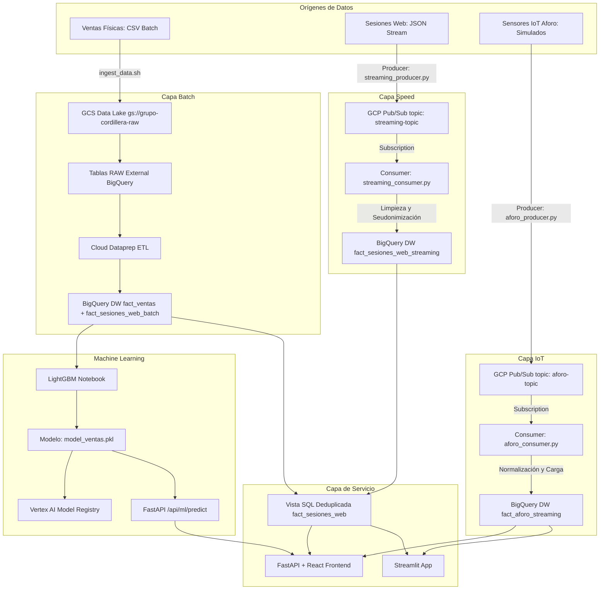
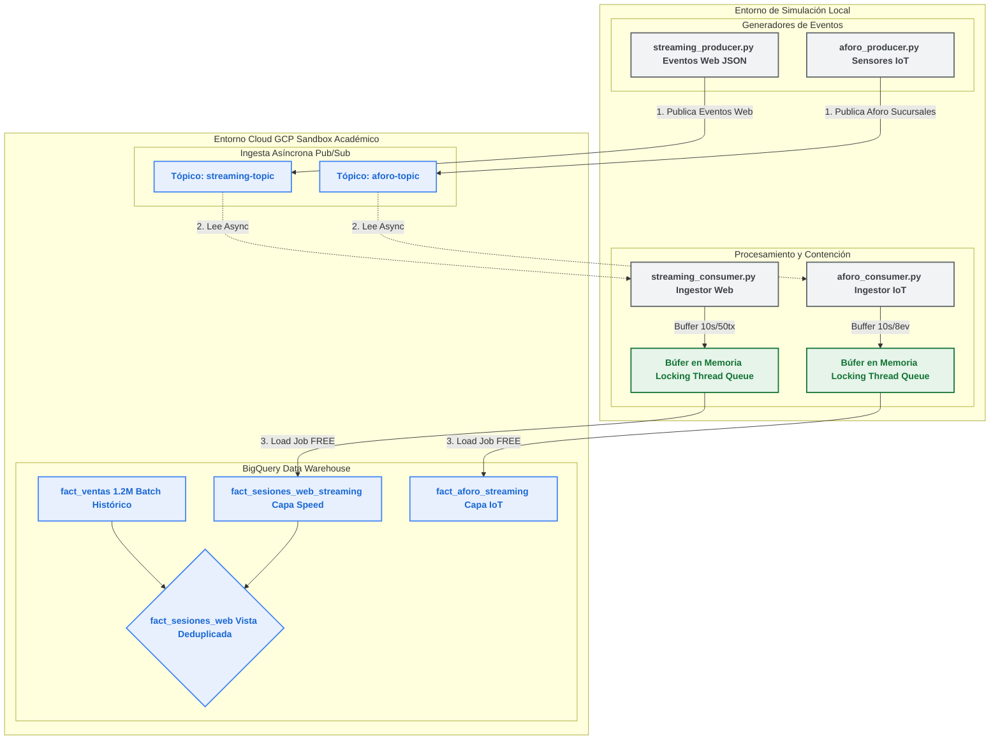
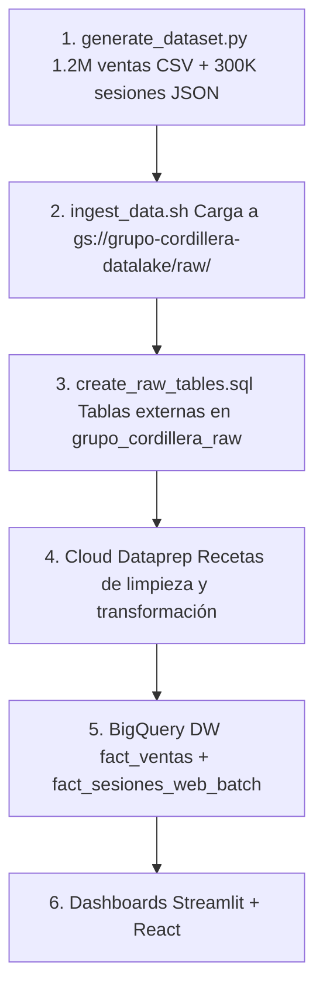
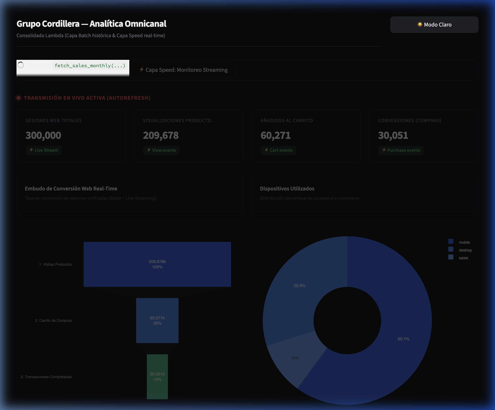
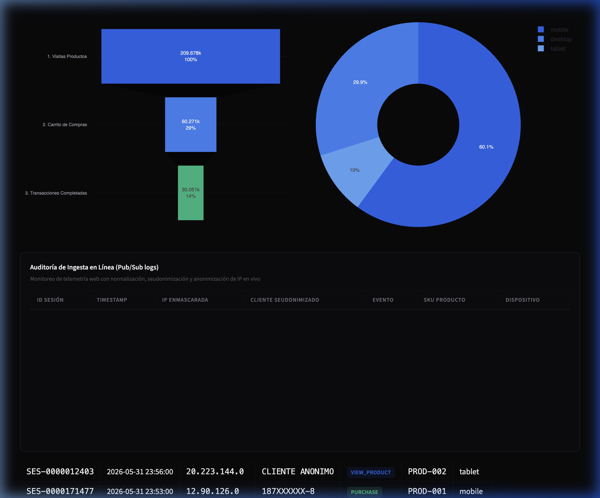

<style>
p { text-align: justify; text-justify: inter-word; } li { text-align: justify; }
</style>

<div align="justify">

# INFORME FINAL: PROYECTO INTEGRAL DE BIG DATA

## GRUPO CORDILLERA — EXAMEN TRANSVERSAL

**Asignatura:** Big Data (AVY1101) — Duoc UC, Escuela de Informática y Telecomunicaciones

---

### PORTADA

* **Integrante:** Héctor Águila V.
* **Sección:** `Big Data_003V`
* **Docente:** `Giocrisrai Godoi`
* **Fecha de Entrega:** Junio de 2026

---

## ÍNDICE

1. **Introducción**
2. **Justificación de la Solución Big Data (Aplicación de las 5Vs)**
3. **Selección y Justificación de la Arquitectura**
   * 3.1. Evaluación del Ecosistema On-Premise (Descartado)
   * 3.2. Selección Oficial: Google Cloud Platform (GCP)
   * 3.3. Diseño de la Arquitectura Lambda Unificada y MLOps
   * 3.4. Arquitectura Híbrida de Simulación y Contención (GCP Sandbox Bypass)
4. **Procesos, Flujos de Información y Orquestación de Datos**
   * 4.1. Pipeline Batch End-to-End
   * 4.2. Pipeline Streaming End-to-End (Capa Speed)
   * 4.3. Pipeline IoT: Sensores de Aforo en Tiempo Real
   * 4.4. Orquestación y Automatización
5. **Conexiones con las Fuentes de Datos**
   * 5.1. Fuentes Batch (Archivos CSV y JSON)
   * 5.2. Fuentes Streaming (Pub/Sub Event Bus)
   * 5.3. Fuentes IoT (Sensores de Aforo Simulados)
6. **Generación de Archivos en el Data Lake**
   * 6.1. Estructura del Data Lake en Cloud Storage
   * 6.2. Políticas de Archivado Automático (Ciclo de Vida del Dato)
7. **Procesos de Limpieza, Transformación y Carga**
   * 7.1. Limpieza Batch (Cloud Dataprep)
   * 7.2. Limpieza Streaming en Vuelo (Python Consumers)
   * 7.3. Deduplicación en la Capa de Servicio (Vista SQL Unificada)
   * 7.4. Esquema del Data Warehouse en BigQuery
8. **Gobierno de Datos, Privacidad y Cumplimiento (Ley N° 21.719)**
9. **Reportes y Visualizaciones (Paneles de Control)**
   * 9.1. Dashboard Streamlit
   * 9.2. Frontend React + Vite con FastAPI
   * 9.3. Campos Calculados e Indicadores Clave (KPIs)
10. **Machine Learning y MLOps**
    * 10.1. Pronóstico de Ventas con LightGBM
    * 10.2. Serving del Modelo vía API
    * 10.3. Capa Operativa de MLOps con Vertex AI
11. **Anexo Técnico: Requisitos Adicionales de la Evaluación**
    * 11.1. Control de Errores (Requisito a)
    * 11.2. Control de Duplicidad de Datos (Requisito b)
    * 11.3. Registro de Actividad (Requisito c)
    * 11.4. Validación de Datos, Métricas de Calidad y Trazabilidad (Requisito d)
12. **Origen de Datos Sintéticos y Desafíos de Realismo**
13. **Diferencias entre la Propuesta de Diseño y la Implementación Final**
14. **Conclusiones**

---

## 1. Introducción

El presente informe consolida el **Proyecto Integral de Big Data** desarrollado a lo largo del semestre para el **Grupo Cordillera**, empresa de retail nacional con 650 empleados, más de 30 sucursales y un canal de comercio electrónico en crecimiento. El proyecto aborda la migración desde una infraestructura analítica tradicional basada en reportes manuales hacia un ecosistema de procesamiento distribuido en la nube, capaz de ingerir, transformar, almacenar y visualizar grandes volúmenes de datos tanto históricos como en tiempo real.

La solución implementa una **Arquitectura Lambda** completa sobre **Google Cloud Platform (GCP)**, integrando tres capas de procesamiento: **Batch** (datos históricos de ventas), **Speed** (sesiones web de e-commerce en tiempo real) e **IoT** (sensores de aforo en sucursales físicas). La arquitectura cumple con las exigencias normativas chilenas de protección de datos personales (**Ley N° 21.719**) mediante técnicas de seudonimización y anonimización implementadas directamente en los flujos de ingesta.

Este documento unifica los hallazgos, diseños e implementaciones de las tres evaluaciones parciales, constituyendo la entrega final del Examen Transversal de la asignatura.

---

## 2. Justificación de la Solución Big Data (Aplicación de las 5Vs)

La coexistencia del canal físico tradicional y la interacción digital del Grupo Cordillera se justifica bajo los parámetros fundamentales de Big Data. Retener la infraestructura actual es matemáticamente inviable para la continuidad comercial:

* **Volumen:** La base histórica cuenta con 1.2 millones de transacciones de ventas y 300 mil sesiones web. La capa de streaming añade flujos constantes que impactan el almacenamiento físico sin degradar el rendimiento analítico, soportado por la escalabilidad transparente de BigQuery hacia petabytes.
* **Velocidad:** En fechas críticas de demanda, la detección de comportamiento de navegación y eventos de abandono del carrito exige una latencia de procesamiento inferior a los 5 segundos para que Marketing o Logística actúen en tiempo real. Los procesos ETL de carga nocturna son irrelevantes en este escenario.
* **Variedad:** Coexisten datos transaccionales estructurados (CSV) y eventos de navegación semi-estructurados en formato JSON (NDJSON) provenientes de la navegación web. Los datasets sintéticos fueron generados con asistencia de modelos de IA (Gemini, DeepSeek y Opus) para lograr distribuciones estadísticas realistas (Pareto, Zipf) y cohesión semántica en los datos de prueba.
* **Veracidad:** El reporte humano es fuente fundamental de errores operativos en Cordillera (afectando al 65% de la carga actual de reportes). La limpieza analítica se ejecuta en tiempo real sobre el flujo web, corrigiendo timestamps mal formateados e ignorando logs incompletos antes de consolidar los registros en el Data Warehouse.
* **Valor:** La unión del histórico Batch y el tiempo real Streaming permite al negocio optimizar inventarios, estimar tasas de propensión de compra en la sesión activa, diseñar embudos de conversión dinámicos y predecir volúmenes de venta futuros con Machine Learning.

---

## 3. Selección y Justificación de la Arquitectura

### 3.1. Evaluación del Ecosistema On-Premise (Descartado)

Si el Grupo Cordillera desarrollara un centro de datos propio, la pila requerida sería operativa pero rígida económicamente:

* **Hadoop (HDFS):** Actúa como disco duro distribuido. Soluciona el almacenamiento masivo económico inicial.
* **Apache Spark:** Analizador en memoria que podría calcular las ventas de las 30 sucursales nacionales en segundos de procesamiento sin acceder permanentemente a discos.
* **Apache Cassandra:** Base NoSQL columnar de alta disponibilidad que operaría ininterrumpidamente para sostener las peticiones del sitio e-commerce.
* **MongoDB:** Útil para mantener catálogos flexibles y semi-estructurados con diversas cantidades asimétricas de atributos para diferentes artículos.

**Justificación del Descarte:** Levantar los cuartos físicos, la mantenibilidad técnica y las licencias anulan el presupuesto operativo. Es un proyecto de altísima fricción estructural.

### 3.2. Selección Oficial: Google Cloud Platform (GCP)

Alineado con el crecimiento sostenible de la industria, Cordillera migró su carga a los servicios administrados de **Google Cloud Platform (GCP)**:

* **Google Cloud Storage (GCS):** Repositorio central del Data Lake. Almacenamiento de objetos distribuido, altamente escalable y de menor costo operativo que nodos locales de HDFS.
* **Google Cloud Pub/Sub:** Bus de mensajería asíncrono y escalable para la distribución de eventos en tiempo real.
* **Google Cloud Dataflow / Dataprep:** Motor de procesamiento a gran escala que estructura y unifica los datos para su carga en el almacén analítico.
* **BigQuery:** Almacén de datos analítico serverless para consultas SQL masivas.
* **Vertex AI:** Capa operativa de MLOps para automatizar el ciclo de vida de modelos de Machine Learning.

### 3.3. Diseño de la Arquitectura Lambda Unificada y MLOps

La solución adopta un patrón de **Arquitectura Lambda** híbrido diseñado en capas para conciliar latencia e inmutabilidad:



**Análisis Crítico de la Arquitectura:**

1. **Escalabilidad nativa:** Los servicios administrados en GCP permiten el aprovisionamiento dinámico y el autoescalado de recursos.
2. **Seguridad Diferenciada:** La separación de capas permite implementar políticas de control de acceso (IAM) diferenciadas. El pipeline Batch opera de forma aislada de la Capa Speed.
3. **Garantía de Consistencia:** Las posibles inconsistencias del procesamiento de flujo rápido (Capa Speed) son corregidas y consolidadas periódicamente por el pipeline Batch, asegurando la consistencia final de los datos históricos.
4. **Eficiencia y Optimización:** Los usuarios de negocio pueden consultar vistas unificadas que combinan datos históricos y en tiempo real en milisegundos.
5. **Operacionalización de Modelos Inteligentes (MLOps):** La Capa Speed consume predicciones inmediatas de baja latencia mediante endpoints en línea, mientras que la Capa Batch ejecuta predicciones masivas diferidas para planificar la distribución logística.

### 3.4. Arquitectura Híbrida de Simulación y Contención (GCP Sandbox Bypass)

Para eludir las restricciones de facturación y cuotas del entorno GCP Sandbox (que bloquea los *Streaming Inserts* directos a BigQuery e impide levantar nodos de Cloud Dataflow), se diseñó un flujo híbrido que desacopla la mensajería en la nube de la ingesta física:



Esta solución representa una decisión crítica de arquitectura: se delega la orquestación y el almacenamiento intermedio en memoria local, mientras que el transporte (Pub/Sub), almacenamiento analítico masivo (BigQuery) y modelamiento predictivo (Vertex AI) se mantienen en la nube de GCP.

---

## 4. Procesos, Flujos de Información y Orquestación de Datos

### 4.1. Pipeline Batch End-to-End

El procesamiento batch procesa la información histórica acumulada para la generación de reportes ejecutivos:



1. Los archivos se suben al Data Lake en Cloud Storage mediante script automatizado.
2. Se exponen a BigQuery a través de tablas externas vinculadas directamente a las rutas de almacenamiento.
3. Cloud Dataprep procesa los lotes periódicamente y carga los resultados limpios en tablas físicas dentro de BigQuery (`grupo_cordillera_dw`).

### 4.2. Pipeline Streaming End-to-End (Capa Speed)

Diseñada para procesar datos de navegación web con baja latencia:

* **Tópico Pub/Sub:** `projects/cordillerabi/topics/streaming-topic`
* **Suscripción:** `projects/cordillerabi/subscriptions/streaming-subscription`

El script `streaming_producer.py` simula la telemetría en tiempo real: lee secuencialmente el archivo `data/sesiones_web.json`, valida la estructura de cada objeto y los publica a la API de Pub/Sub con un retardo configurable.

El script `streaming_consumer.py` ejecuta un patrón de **Micro-batching en Memoria**:

1. Escucha mensajes de la suscripción Pub/Sub de manera asíncrona.
2. **Normaliza el timestamp:** Convierte el formato ISO al formato de fecha SQL de BigQuery.
3. **Seudonimiza el ID del cliente:** Oculta los dígitos centrales del RUT (`123XXXXXX-K`) para cumplir la Ley N° 21.719.
4. **Anonimiza la IP:** Reemplaza el último octeto por `.0` para proteger la privacidad de red.
5. **Micro-batching:** Almacena los registros limpios en una lista protegida por bloqueos de exclusión mutua (`threading.Lock`). Cada 10 segundos o 50 registros, realiza un **Load Job de BigQuery** (`load_table_from_json`) para subir los datos. Los Load Jobs son libres de costo y permitidos en el Sandbox.

### 4.3. Pipeline IoT: Sensores de Aforo en Tiempo Real

Para complementar la telemetría web con datos del mundo físico, se diseñó una capa de sensores IoT que simula la ocupación en las **30 sucursales físicas** de Grupo Cordillera, distribuidas estratégicamente en 4 zonas geográficas:

| Zona | Regiones | Sucursales | Ejemplos |
| :--- | :--- | :--- | :--- |
| **Norte** | XV, I, II, III, IV | 5 | Arica, Iquique, Antofagasta, Copiapó, La Serena |
| **Centro** | V, RM, VI, VII | 12 | Santiago, Viña del Mar, Rancagua, Talca |
| **Sur** | XVI, VIII, IX, XIV, X | 9 | Concepción, Temuco, Valdivia, Puerto Montt |
| **Austral** | XI, XII | 2 | Coyhaique, Punta Arenas |

* **Tópico Pub/Sub:** `projects/cordillerabi/topics/aforo-topic`
* **Suscripción:** `projects/cordillerabi/subscriptions/aforo-subscription`
* **Tabla destino:** `cordillerabi.grupo_cordillera_dw.fact_aforo_streaming`, particionada por día, clusterizada por `id_sucursal`, con campos `zona` y `region` para segmentación geográfica.

El script `aforo_producer.py` simula la fluctuación de personas en cada tienda utilizando tres factores de ponderación:

1. **Factor horario:** Modela la concurrencia según la hora del día (peak 18-20h con 2.5x, valle nocturno 0-8h con 0.1x).
2. **Factor diario:** Fines de semana con 1.5x sobre la base laboral.
3. **Factor zonal:** Centro tiene mayor afluencia (1.0-1.2x), Sur y Austral menor (0.5-1.0x), reflejando la densidad poblacional y climática de Chile.

### 4.4. Orquestación y Automatización

Se construyó un script orquestador maestro en Python (`run_simulation.py`) para automatizar y demostrar la consistencia del flujo en vivo. El orquestador gestiona 4 procesos simultáneos: consumidor web, productor web, consumidor aforo IoT y productor aforo IoT. Al ejecutarlo:

1. Limpia archivos PID huérfanos de ejecuciones anteriores.
2. Inicia los 4 procesos en segundo plano redirigiendo sus logs individualmente.
3. Consulta BigQuery recursivamente cada 5 segundos mostrando la tasa de ingesta de ambas tablas streaming.

Adicionalmente, se crearon dos scripts shell de arranque con limpieza automática de procesos previos:

* **`start_streamlit.sh`** — Inicia el pipeline streaming web + dashboard Streamlit.
* **`start_react.sh`** — Inicia el pipeline completo (web + aforo) + FastAPI + frontend React, matando procesos anteriores automáticamente para evitar conflictos de PID y puertos.

```bash
# Opción 1: Streamlit (solo web streaming)
./start_streamlit.sh

# Opción 2: React completo (web + IoT + FastAPI + frontend)
./start_react.sh

# Opción 3: Orquestador manual
python Unidad3/scripts/run_simulation.py
```

*Evidencia en consola durante la simulación:*

```
=====================================================================
   SIMULADOR DE PIPELINE EN TIEMPO REAL - GRUPO CORDILLERA
=====================================================================
[+] Iniciando Capa Speed: Consumidor en streaming...
[✓] Consumidor iniciado con éxito (PID: 23512)
[+] Iniciando Productor (Simulador de eventos web)...
[✓] Productor iniciado con éxito (PID: 23515)
---------------------------------------------------------------------
 Simulación en curso. Monitoreando base de datos BigQuery...
 Presioná CTRL+C para detener la simulación de forma segura.
---------------------------------------------------------------------
[*] Registros iniciales en BigQuery (tabla streaming): 158
[11:32:05] Filas en BQ: 173 (Ingestados en esta sesión: +15 | Últimos 5s: +15)
[11:32:10] Filas en BQ: 188 (Ingestados en esta sesión: +30 | Últimos 5s: +15)
[11:32:15] Filas en BQ: 203 (Ingestados en esta sesión: +45 | Últimos 5s: +15)
^C
[+] Deteniendo la simulación de forma segura...
[-] Apagando productor...
[-] Apagando consumidor...
[✓] Simulación finalizada.
```

---

## 5. Conexiones con las Fuentes de Datos

### 5.1. Fuentes Batch (Archivos CSV y JSON)

La ingesta batch se automatizó mediante el script `ingest_data.sh`, que realiza:

* Validación de la autenticación de la CLI de GCP (`gcloud`).
* Verificación y configuración del ID de proyecto activo (`cordillerabi`).
* Creación automática de un bucket regional en `us-central1` si no existe (`gs://grupo-cordillera-datalake-cordillerabi`).
* Carga de los archivos `ventas_historicas.csv` (1.2 millones de registros) y `sesiones_web.json` (300 mil registros) al directorio `/raw/` del bucket.

### 5.2. Fuentes Streaming (Pub/Sub Event Bus)

Los eventos de navegación web en vivo se publican en un tópico de **Google Cloud Pub/Sub**:

* **Tópico:** `streaming-topic` — punto de entrada para logs de sesiones web en formato NDJSON.
* **Tópico:** `aforo-topic` — punto de entrada para datos de sensores IoT de aforo.
* Cada tópico cuenta con su suscripción dedicada para consumo desacoplado.

### 5.3. Fuentes IoT (Sensores de Aforo Simulados)

Los sensores de aforo en las 30 sucursales físicas del Grupo Cordillera publican lecturas de ocupación cada 5 segundos a `aforo-topic`, conteniendo coordenadas GPS, capacidad máxima, flujo de personas, zona geográfica y región administrativa.

---

## 6. Generación de Archivos en el Data Lake

### 6.1. Estructura del Data Lake en Cloud Storage

Los archivos crudos se almacenan en el bucket de Cloud Storage bajo la siguiente estructura:

```
gs://grupo-cordillera-datalake-cordillerabi/
  └── raw/
      ├── ventas_historicas.csv      (1.2M registros, ~130 MB)
      └── sesiones_web.json          (300K registros NDJSON, ~45 MB)
```

Para no incurrir en costos de almacenamiento duplicado de datos crudos, se definieron **tablas externas** en BigQuery mediante DDL SQL bajo el dataset `grupo_cordillera_raw`. Esto permite mapear la estructura de los archivos de Cloud Storage y consultarlos directamente usando sintaxis SQL estándar de BigQuery.

### 6.2. Políticas de Archivado Automático (Ciclo de Vida del Dato)

Para mitigar costos de almacenamiento de datos de retención regulatoria histórica, se establece una política de ciclo de vida (Object Lifecycle Management) en Cloud Storage:

* Los archivos crudos se mueven de la clase de almacenamiento estándar a **Coldline** a los 90 días.
* A los 365 días se trasladan automáticamente a la clase **Archive**, reduciendo los costos de almacenamiento a fracciones mínimas.

---

## 7. Procesos de Limpieza, Transformación y Carga

### 7.1. Limpieza Batch (Cloud Dataprep)

Se implementaron recetas en Cloud Dataprep. Las operaciones aplicadas incluyen:

* **Manejo de Formatos Monetarios:** Limpieza de `monto_clp` mediante eliminación de caracteres especiales (`$`, `,`) y conversión a enteros (`Integer`).
* **Normalización Temporal:** Conversión del campo `fecha` a tipo `Datetime` y extracción de columnas enriquecidas: año, mes y día de la semana.
* **Anonimización e IP Masking:** Seudonimización del RUT y enmascaramiento del último octeto de las direcciones IP en los logs web.
* **Filtros de calidad:** Eliminación de registros con montos negativos (`monto_clp <= 0`), cantidades faltantes o erróneas (`cantidad <= 0` o valores nulos).

Las recetas de Cloud Dataprep son compiladas automáticamente a código de **Apache Beam** y ejecutadas de forma nativa sobre **Google Cloud Dataflow** de manera serverless.

### 7.2. Limpieza Streaming en Vuelo (Python Consumers)

Los scripts consumidores ejecutan validaciones automatizadas sobre cada mensaje entrante de Pub/Sub:

1. **Validación de Timestamps:** Si el timestamp presenta anomalías en su codificación ISO, el pipeline captura la excepción y aplica un fallback automático asignando el timestamp actual del sistema (UTC).
2. **Seudonimización del RUT:** El `customer_id` se transforma a `id_anonimo_cliente` preservando solo el prefijo y el dígito verificador (`123XXXXXX-K`).
3. **Anonimización de IP:** Se reemplaza el último octeto por `.0` (ej. `192.168.1.X` → `192.168.1.0`).
4. **Descarte de mensajes corruptos:** Los mensajes con formato JSON inválido se rechazan (`nack`) y se registran en el log de errores.

### 7.3. Deduplicación en la Capa de Servicio (Vista SQL Unificada)

Para resolver la duplicidad de datos cuando una re-ejecución del pipeline o una sesión solapada devuelve datos que ya existen en el batch histórico, se creó la vista lógica `fact_sesiones_web`:

```sql
CREATE OR REPLACE VIEW `cordillerabi.grupo_cordillera_dw.fact_sesiones_web` AS
WITH union_data AS (
  SELECT session_id, timestamp, ip_anonima, id_anonimo_cliente,
         event_type, sku_product, device, 'BATCH' as origen
  FROM `cordillerabi.grupo_cordillera_dw.fact_sesiones_web_batch`
  UNION ALL
  SELECT session_id, timestamp, ip_anonima, id_anonimo_cliente,
         event_type, sku_product, device, 'STREAMING' as origen
  FROM `cordillerabi.grupo_cordillera_dw.fact_sesiones_web_streaming`
)
-- Deduplicación lógica priorizando registros batch (consolidados)
SELECT * EXCEPT(row_num, origen)
FROM (
  SELECT *,
         ROW_NUMBER() OVER(
           PARTITION BY session_id
           ORDER BY CASE WHEN origen = 'BATCH' THEN 1 ELSE 2 END, timestamp DESC
         ) as row_num
  FROM union_data
)
WHERE row_num = 1;
```

### 7.4. Esquema del Data Warehouse en BigQuery

Los datos procesados se consolidan en el dataset `grupo_cordillera_dw` (región `us-central1`):

| Tabla | Capa | Campos Principales |
| :--- | :--- | :--- |
| `fact_ventas` | Batch | `id_transaccion`, `fecha`, `id_sucursal`, `id_anonimo_cliente`, `sku`, `cantidad`, `monto_clp`, `metodo_pago` |
| `fact_sesiones_web_batch` | Batch | `session_id`, `timestamp`, `ip_anonima`, `id_anonimo_cliente`, `event_type`, `sku_product`, `device` |
| `fact_sesiones_web_streaming` | Speed | Misma estructura que batch, alimentada en tiempo real |
| `fact_aforo_streaming` | IoT | `timestamp`, `id_sucursal`, `nombre_sucursal`, `lat`, `lng`, `capacidad_maxima`, `aforo_actual`, `personas_entran`, `personas_salen`, `porcentaje_ocupacion`, `zona`, `region` |
| `fact_sesiones_web` | Vista | Unión deduplicada de batch y streaming |

> [!IMPORTANT]
> **Consistencia de Regiones:** El dataset de destino `grupo_cordillera_dw` fue creado estrictamente en la misma región que las fuentes crudas (`us-central1`). BigQuery restringe la lectura y escritura cruzada entre diferentes regiones geográficas.

---

## 8. Gobierno de Datos, Privacidad y Cumplimiento (Ley N° 21.719)

El Grupo Cordillera está sometido a las normativas de protección de datos personales vigentes en Chile. La solución incorpora:

* **Privacidad desde el Diseño (Privacy by Design):** Los identificadores sensibles del e-commerce (`customer_id` / RUT) no se almacenan nunca en formato plano dentro del Data Warehouse. El script de streaming seudonimiza el RUT en el vuelo, y Dataprep aplica enmascaramiento irreversible en la capa batch.
* **Descarte de Datos Sensibles:** Las columnas originales que contienen los RUTs e identificadores crudos son eliminadas (`drop`) de manera irreversible antes de almacenar los resultados. Esto impide que analistas con acceso al Data Warehouse o al Dashboard puedan re-identificar a los clientes.
* **Trazabilidad:** La procedencia de los registros es auditable en todo momento, manteniendo el origen del dato y documentando su ciclo de vida en `pipeline_execution.log`.
* **Políticas de Archivado:** Los archivos crudos del Data Lake en Cloud Storage se gestionan mediante políticas de ciclo de vida automáticas, migrando a **Coldline** a los 90 días y a **Archive** a los 365 días.
* **Ética de Datos y Transparencia:** Se establece el principio de proporcionalidad en la captura de telemetría web. Los datos recopilados se restringen estrictamente a la mejora de la usabilidad y la conversión, asegurando que el análisis de navegación no sea utilizado para la manipulación de precios o la discriminación de usuarios.

---

## 9. Reportes y Visualizaciones (Paneles de Control)

A continuación se presenta la interfaz del panel de control ejecutivo diseñado para el análisis consolidado de las operaciones de Grupo Cordillera:


### 9.1. Dashboard Streamlit

Se implementó un dashboard interactivo en **Streamlit** (`app.py`) con cuatro pestañas:

1. **📊 Capa Batch: Ventas Transaccionales** — KPIs históricos (transacciones totales, monto facturado, ticket promedio), evolución mensual de ingresos, desempeño por sucursal con nombres de ciudad, participación de métodos de pago y tabla de últimas transacciones.
2. **⚡ Capa Speed: Monitoreo Streaming** — Sesiones web en vivo, embudo de conversión, distribución por dispositivo y tabla de auditoría con IP anonimizada y cliente seudonimizado.
3. **📡 Capa IoT: Aforo en Vivo** — Ocupación por sucursal con nombres de ciudad, semáforo de capacidad, flujo de personas (entran/salen), segmentado por zona geográfica.
4. **🤖 ML: Pronóstico Ventas** — Predicción del próximo mes por sucursal vs. último mes real, consumiendo el endpoint FastAPI `/api/ml/predict`, con variación porcentual y semáforo.

El dashboard utiliza un sistema de diseño CSS basado en variables para soporte de tema oscuro/claro. Los datos batch se cachean mediante `@st.cache_data` para evitar reconsultas a BigQuery. Los datos streaming, aforo y ML se refrescan automáticamente cada **60 segundos**.

A continuación se presenta una captura de pantalla de la pestaña de monitoreo en tiempo real en Streamlit (Capa Speed):



### 9.2. Frontend React + Vite con FastAPI

Como alternativa moderna y de nivel producción, se desarrolló un frontend en **React + Vite + TypeScript** con Tailwind CSS, Recharts y Leaflet:

* **Backend proxy:** FastAPI (`main.py`) con **9 endpoints** (batch KPIs, streaming KPIs, dispositivos, métodos de pago, aforo current, aforo history, ventas mensuales, ventas por sucursal, ML predict) que consultan BigQuery y exponen los datos como API REST. El modelo ML se carga automáticamente desde `model_ventas.pkl` al iniciar el servidor.
* **Layout CRM:** Sidebar lateral izquierda con navegación por pestañas (Resumen, Ventas, Streaming, Sucursales, Aforo IoT, ML Forecast) y contador regresivo de 60s para actualización automática.
* **Mapa nacional interactivo:** Las 30 sucursales geolocalizadas sobre mapa Leaflet con marcadores coloreados por ocupación (verde/amarillo/rojo).
* **Segmentación por zona:** Las sucursales se agrupan por zona geográfica (Norte, Centro, Sur, Austral) con cards individuales y barra de progreso.
* **Stack moderno:** Vite como bundler, Tailwind CSS para estilos utilitarios, Recharts para gráficos, Leaflet para mapas interactivos, Lucide React para iconografía, pnpm como gestor de paquetes.

A continuación se presenta una captura de pantalla del panel de control web desarrollado en React (Capa Speed y visualización en tiempo real):



### 9.3. Campos Calculados e Indicadores Clave (KPIs)

Se crearon campos calculados directamente en los dashboards para enriquecer la capa de presentación sin modificar el Data Warehouse:

* **Campo `Canal de Venta`:** Clasificación de transacciones por canal (E-Commerce vs. Tienda Física) basado en `id_sucursal`.
* **Campo `Etapa del Cliente`:** Traducción de `event_type` a etiquetas en español con orden secuencial para el embudo de conversión.

**KPIs ejecutivos:**

1. **Total Transacciones:** 1.200.000 registros.
2. **Monto Facturado:** $1.838.769.817.641 CLP acumulados.
3. **Ticket Promedio:** Calculado por sucursal y canal.

---

## 10. Machine Learning y MLOps

### 10.1. Pronóstico de Ventas con LightGBM

Para habilitar la analítica avanzada sobre la arquitectura Lambda, se desarrolló un notebook de entrenamiento (`lightgbm_forecast_ventas.ipynb`) que implementa un modelo de pronóstico de ventas por sucursal y mes utilizando **LightGBM**.

**Ingeniería de Features:**

| Tipo | Feature | Descripción |
| :--- | :--- | :--- |
| **Rezagos** | `lag_1`, `lag_2`, `lag_3`, `lag_12` | Ventas del mes anterior, 2, 3 y 12 meses atrás |
| **Media Móvil** | `rolling_3` | Promedio móvil de los últimos 3 meses |
| **Estacionalidad** | `month_sin`, `month_cos` | Codificación cíclica del mes (seno/coseno) |
| **Tendencia** | `trend` | Meses transcurridos desde enero 2016 |
| **Categórica** | `id_sucursal` | Codificada como categoría para efectos fijos |
| **Trimestre** | `quarter` | Trimestre del año (1-4) |

**Entrenamiento y Evaluación:**

* **Split:** Train 2016–2024 (108 meses), Test 2025–2026 (12 meses).
* **Early stopping:** Paciencia de 10 rondas para evitar sobreajuste.
* **Métricas:** RMSE, MAE y MAPE sobre el conjunto de test.
* **Feature importance:** Las variables más influyentes resultan ser los rezagos `lag_1` y `lag_12`, seguidas de la tendencia y la estacionalidad.

### 10.2. Serving del Modelo vía API

El modelo exportado `model_ventas.pkl` se carga en el **FastAPI backend** al iniciar y se sirve a través del endpoint `GET /api/ml/predict`. Este endpoint:

1. Consulta `fact_ventas` para obtener las features más recientes por sucursal.
2. Reconstruye las 13 features de entrenamiento (rezagos, rolling, estacionalidad, tendencia).
3. Ejecuta la predicción con LightGBM.
4. Retorna JSON con `id_sucursal`, `prediccion` (próximo mes) y `real_ultimo_mes`.

El frontend React consume este endpoint en el tab **ML Forecast**, mostrando cards por sucursal con variación porcentual y semáforo.

### 10.3. Capa Operativa de MLOps con Vertex AI

Para integrar los modelos predictivos que alimentan el dashboard analítico del negocio, se define el ciclo operativo de MLOps mediante los siguientes componentes de **Vertex AI**:

1. **Vertex AI Pipelines:** Automatiza el re-entrenamiento mensual de modelos de propensión de compra a partir de los datos históricos consolidados.
2. **Model Registry:** Gestiona el control de versiones y el ciclo de vida de los modelos entrenados.
3. **Feature Store:** Almacena atributos calculados (ticket promedio, categoría favorita) sirviéndolos a bajísima latencia para alimentar el scoring.
4. **Prediction Endpoints:** Expone endpoints online (para inferencia en tiempo real en la Capa Speed) y batch (para proyecciones logísticas en BigQuery).

```bash
gcloud ai models upload \
  --region=us-central1 \
  --display-name=lightgbm_ventas \
  --container-image-uri=us-docker.pkg.dev/vertex-ai/prediction/sklearn-cpu.1-0:latest \
  --artifact-uri=gs://model-artifacts-ventas/
```

---

## 11. Anexo Técnico: Requisitos Adicionales de la Evaluación

### 11.1. Control de Errores (Requisito a)

* **Pipeline Batch (Dataprep):** Los filtros de calidad de datos eliminan registros con montos negativos, cantidades faltantes o erróneas. Los registros con inconsistencias se descartan del flujo analítico sin interrumpir la ejecución del Job.
* **Pipeline Streaming (Consumers):** Los mensajes con formato JSON inválido son capturados por bloques `try/except`, descartados con `message.nack()` y registrados en el log de errores. Los timestamps corruptos se resuelven con un fallback automático al timestamp UTC del sistema.
* **Control de Concurrencia (PID Lock):** Al arrancar el productor o consumidor, verifica si existe el archivo de bloqueo (`streaming_producer.pid` / `streaming_consumer.pid`). Lee el PID anterior y comprueba si sigue corriendo en la memoria del sistema operativo. Si está activo, el proceso actual se auto-bloquea de inmediato y aborta la ejecución con un mensaje de alerta, garantizando consistencia.

### 11.2. Control de Duplicidad de Datos (Requisito b)

* **Pipeline Batch:** Se aplica la regla de deduplicación integrada de Dataprep basada en la columna clave `id_transaccion` para asegurar que las re-ejecuciones no dupliquen transacciones históricas. En el destino de BigQuery, el Job de Dataprep está configurado con la opción **Drop table every run**, garantizando una reconstrucción limpia y reproducible.
* **Pipeline Streaming:** La vista SQL unificada `fact_sesiones_web` consolida los datos de batch y streaming mediante `ROW_NUMBER()` particionado por `session_id`, priorizando siempre el registro batch consolidado y eliminando registros duplicados que provengan de re-ejecuciones del consumidor.
* **Control de Ejecución Concurrente:** El bloqueo por PID impide que dos instancias del consumidor corran simultáneamente, previniendo la inserción de mensajes duplicados desde la misma suscripción Pub/Sub.

### 11.3. Registro de Actividad (Requisito c)

* **Log de Auditoría Local:** Todas las acciones de inicialización, detención y conteo de filas cargadas quedan documentadas con fecha y hora en el archivo local `pipeline_execution.log`.
* **Registro Distribuido en GCP:** Las recetas de Cloud Dataprep ejecutadas sobre Cloud Dataflow registran todo el log detallado en **Cloud Logging**, permitiendo auditar ejecuciones pasadas.
* **Trazabilidad del Dato:** La vista SQL de deduplicación mantiene la columna `origen` (BATCH/STREAMING) para rastrear la procedencia de cada registro.

### 11.4. Validación de Datos, Métricas de Calidad y Trazabilidad (Requisito d)

Para cumplir con el aseguramiento de calidad exigido por la pauta del examen final, se auditaron los volúmenes de carga y la presencia de valores nulos o corruptos en el Data Warehouse. La siguiente tabla presenta las métricas reales consolidadas de las bases de datos de BigQuery:

| Tabla Analítica | Capa | Origen de Datos | Total de Filas | Campos Clave Nulos | Nulos de Negocio | Estado de Calidad | Trazabilidad |
| :--- | :--- | :--- | :--- | :--- | :--- | :--- | :--- |
| `fact_ventas` | Batch | GCS External CSV | 1.200.000 | 0 | 0 | **100% Integridad** | Archivos CSV procesados por Dataprep. |
| `fact_sesiones_web_batch` | Batch | GCS External JSON | 300.000 | 0 | 0 | **100% Integridad** | Historial consolidado de navegación. |
| `fact_sesiones_web_streaming` | Speed | Pub/Sub Event Stream | 17.148 | 0 | 6.980 | **100% Conforme** | Eventos web capturados por Pub/Sub y Load Jobs. |
| `fact_aforo_streaming` | IoT | Pub/Sub IoT Sensors | 68.760 | 0 | 0 | **100% Integridad** | Sensores físicos de tiendas en tiempo real. |

*Nota:* Los 6.980 registros nulos detectados en el campo `id_anonimo_cliente` de la tabla `fact_sesiones_web_streaming` corresponden estrictamente a lógica de negocio: representan usuarios visitantes no autenticados en el e-commerce (clientes anónimos), lo cual es el comportamiento estándar esperado de navegación web y no constituye un fallo de calidad.

**Reglas de Validación y Limpieza en Vuelo (Capa Speed):**

1. **Control de Duplicidad y Concurrencia:** Verificación activa del PID de ejecución mediante `check_pid()`. Si ya se encuentra activo un proceso del consumidor, el script aborta inmediatamente evitando inserciones concurrentes y duplicidades de mensajes en BigQuery.
2. **Validación de Timestamps:** Si el timestamp presenta anomalías en su codificación ISO, el pipeline captura la excepción y aplica un fallback automático asignando el timestamp actual del sistema (UTC).
3. **Anonimización y Cumplimiento Legal:** De acuerdo con la **Ley N° 21.719** de Chile, el pipeline aplica seudonimización sobre el RUT y anonimización de direcciones IP enmascarando el último octeto.
4. **Mecanismo de Contención por Buffers:** El uso de Load Jobs sobre BigQuery actúa como un búfer transaccional. En caso de caídas temporales de red, el consumidor retiene la cola de mensajes en memoria y reintenta el volcado en el siguiente ciclo sin pérdida de registros.

---

## 12. Origen de Datos Sintéticos y Desafíos de Realismo

### 12.1. Generación Ética de Datos Sintéticos con Modelos de IA

Para posibilitar la simulación de este ecosistema omnicanal de Big Data, se generaron datasets sintéticos utilizando diversos modelos de Inteligencia Artificial Generativa: **Gemini 3.5 Flash, Gemini 1.5 Pro, Claude Opus 4.6 y DeepSeek V4 Flash**. La declaración explícita del origen sintético de estos datos es un imperativo ético y de transparencia en ingeniería de datos, garantizando que el entorno no exponga información real confidencial de ninguna entidad.

### 12.2. Anomalía de Distribución Inicial (El Falso Equilibrio)

Un error crítico en la etapa inicial del proyecto fue el diseño de scripts que generaban ventas uniformes entre todos los locales comerciales. Esto provocó:

1. **Volúmenes de Facturación Irreales:** Al simular ventas altas y constantes de forma uniforme en más de 30 locales, los ingresos consolidados escalaban a cifras absurdas.
2. **Gráficos Planos y Pérdida de Valor Analítico:** Para subsanar esto, se aplicaron distribuciones de **Pareto y Zipf**, forzando asimetría donde el canal digital absorbe el ~22% de las transacciones y las tiendas físicas compiten de forma realista.

### 12.3. Visualización Acotada (UX) vs. Integridad del Data Warehouse

Se optó por mantener la integridad total de los 31 locales para las consultas y el entrenamiento del modelo de ML, pero limitar la visualización gráfica de los dashboards a las **8 sucursales con mayor volumen de ventas**. Esto evita la saturación visual en la UI sin comprometer el procesamiento de datos del backend.

---

## 13. Diferencias entre la Propuesta de Diseño y la Implementación Final

| Componente | Propuesta de Diseño | Implementación Final Real | Justificación de Ingeniería |
| :--- | :--- | :--- | :--- |
| **Motor de Procesamiento** | Cloud Dataflow (Apache Beam) | Python Micro-batching local | GCP Sandbox tiene deshabilitada la facturación, impidiendo levantar VMs de Dataflow. |
| **Método de Ingesta BQ** | Streaming Inserts (`insertAll` API) | Load Jobs en lotes en memoria (`load_table_from_json`) | Las inserciones streaming están restringidas en la capa gratuita. Los Load Jobs son libres. |
| **Control de Procesos** | Orquestadores nativos de GCP | PID Lock local y logs de auditoría | Evita ejecuciones paralelas concurrentes accidentales. |
| **Distribución de Frecuencia** | Datos aleatorios uniformes | Distribuciones de Pareto y Zipf | Corrige la uniformidad que generaba gráficos planos. |
| **IoT / Sensores** | No contemplado | Pipeline de aforo con Pub/Sub + BigQuery + dashboard | Expande el alcance del proyecto para incluir datos físicos de tienda. |
| **Frontend** | Looker Studio | Streamlit + React + Vite + FastAPI | Se priorizaron dashboards programáticos de mayor control. |
| **Machine Learning** | Propuesta conceptual (MLOps) | Notebook LightGBM + endpoint `/api/ml/predict` + React tab | Se implementó un modelo real de forecasting servido vía API REST. |
| **Seudonimización** | Hash SHA-256 irreversible | Enmascaramiento parcial (`123XXXXXX-K`) | Conserva utilidad analítica para agrupaciones de negocio. |

---

## 14. Conclusiones

La implementación de la **Arquitectura Lambda** completa para el Grupo Cordillera integra tres capas de procesamiento —Batch, Speed e IoT— sobre GCP, logrando un ecosistema analítico omnicanal que captura tanto la interacción digital como la actividad física en tiendas.

**Capas implementadas:**

1. **Capa Batch** — 1.2 millones de transacciones históricas cargadas desde GCS a BigQuery mediante Dataprep, con datos sintéticos generados con distribuciones Zipf y Pareto asistidas por IA.
2. **Capa Speed** — Sesiones web de e-commerce ingeridas en tiempo real vía Pub/Sub, procesadas con limpieza, seudonimización (Ley N° 21.719) y anonimización de IP, cargadas a BigQuery mediante micro-batching con Load Jobs.
3. **Capa IoT** — Sensores de aforo simulados en las 30 sucursales físicas del país, distribuidas en 4 zonas geográficas (Norte, Centro, Sur, Austral) que publican ocupación en vivo a Pub/Sub, con consumidor que persiste en `fact_aforo_streaming`.
4. **Machine Learning** — Modelo LightGBM de pronóstico de ventas por sucursal con feature engineering, early stopping, servido vía endpoint FastAPI `/api/ml/predict` y visualizado en el frontend React. Preparado para migración a Vertex AI Model Registry.

**Superación de restricciones del Sandbox de GCP:** Se reemplazaron los Streaming Inserts bloqueados por Load Jobs por micro-batching en memoria, logrando latencias de ingesta menores a 10 segundos sin incurrir en costos.

**Visualización unificada:** Se entregaron dos dashboards funcionales: una aplicación Streamlit con cuatro pestañas (Batch, Speed, IoT, ML) como capa rápida de prototipado, y un frontend React + Vite con FastAPI backend como interfaz de nivel producción con mapa de calor geolocalizado y gráficos dinámicos.

La arquitectura demuestra que es posible construir un sistema analítico completo, gobernado y extensible sobre GCP respetando las limitaciones de un entorno académico Sandbox, cumpliendo con la normativa chilena de protección de datos y sentando las bases para analítica avanzada con Vertex AI.

**Lecciones aprendidas sobre calidad y realismo del dato:** La simulación de grandes volúmenes de datos demostró que la cantidad no reemplaza la calidad distributiva. El mayor aprendizaje técnico radica en modelar las variables sintéticas imitando el comportamiento orgánico del retail (asimetrías, estacionalidad, vacíos en canales digitales) y diseñar interfaces que gestionen la densidad visual sin desmedro de la integridad total del Data Warehouse.

</div>
