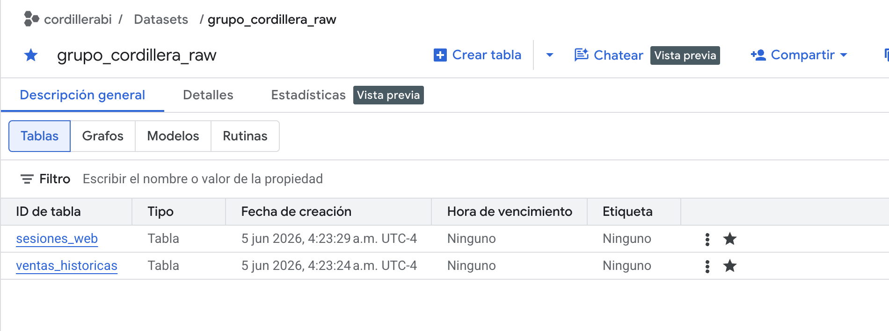
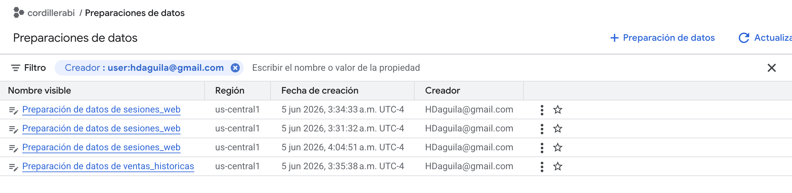
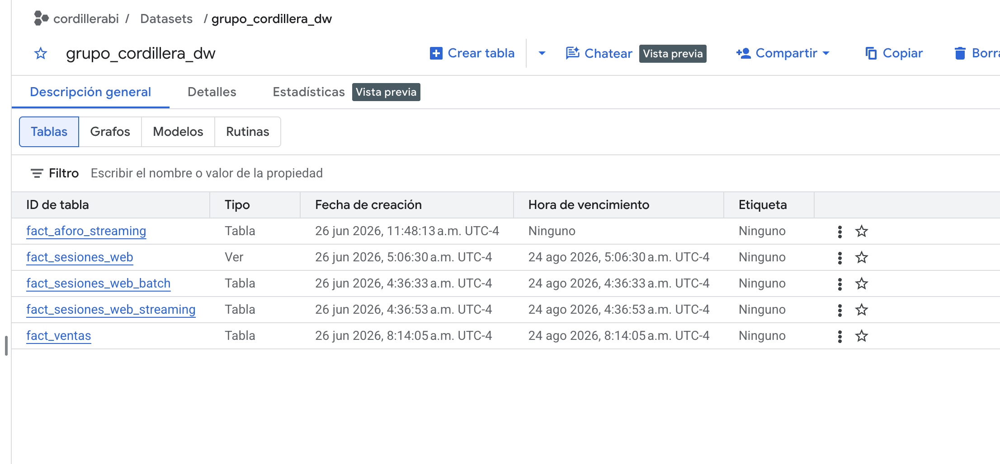
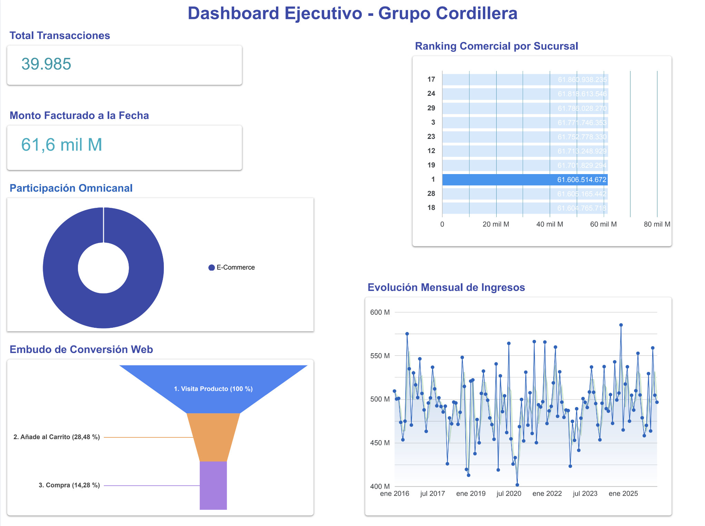
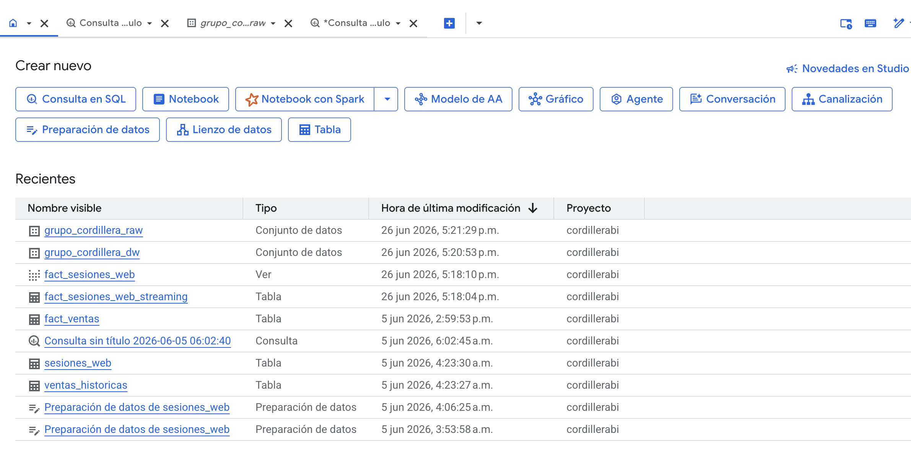
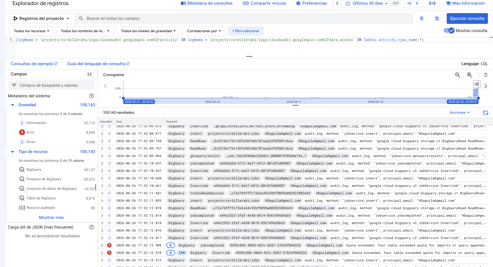
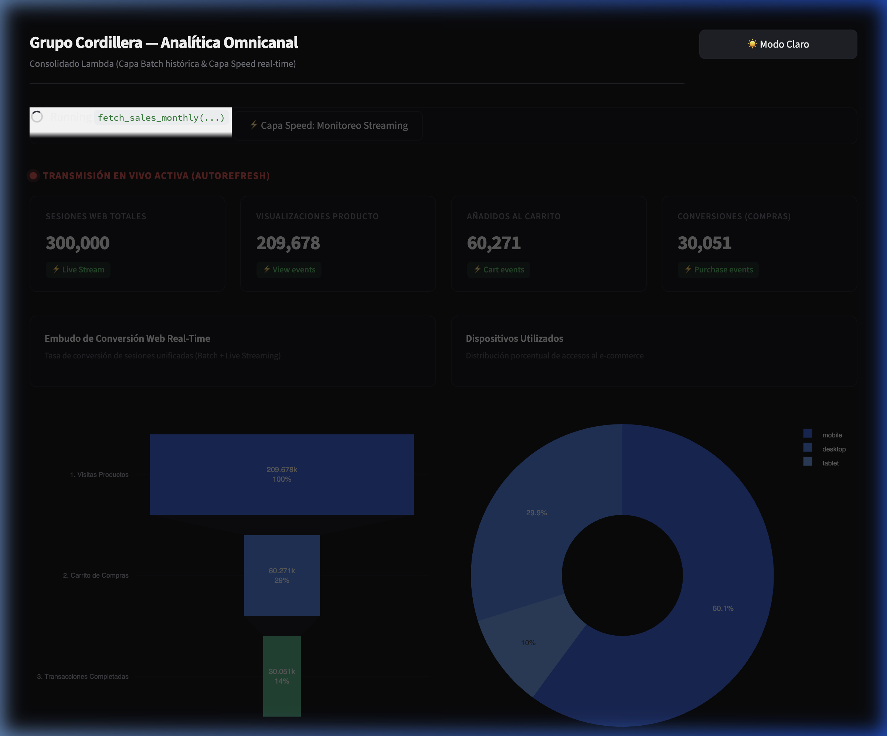
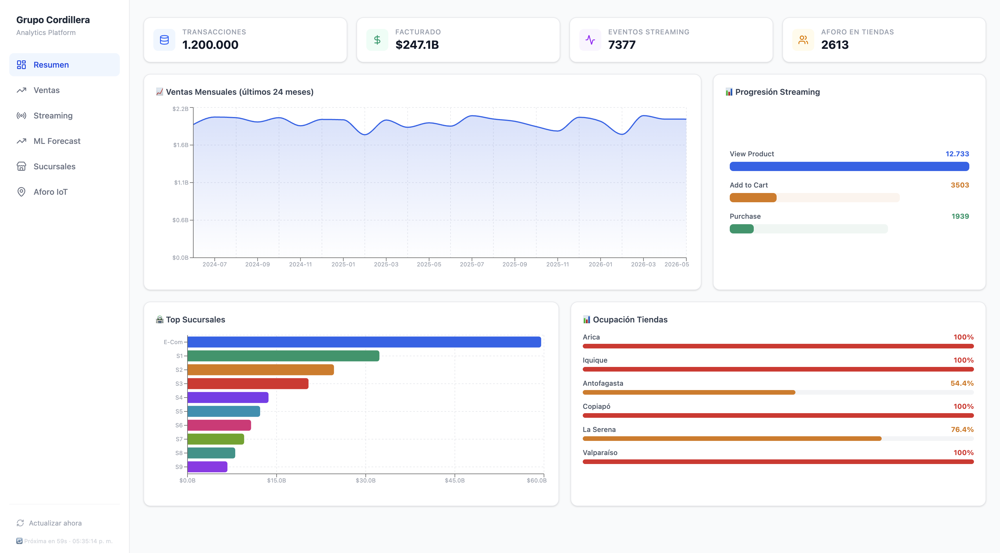
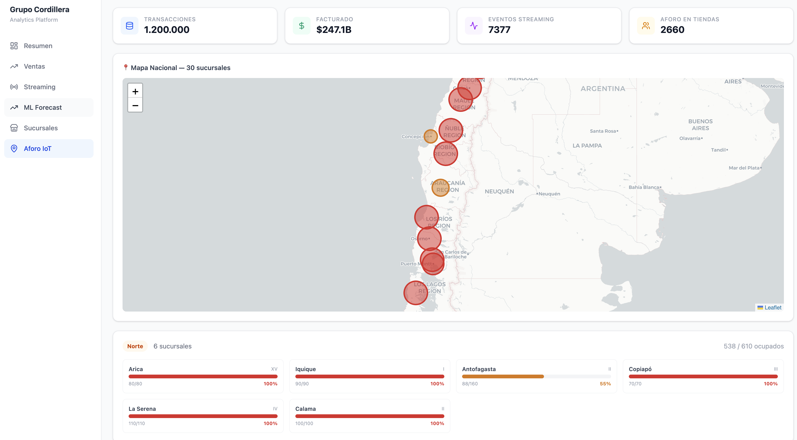
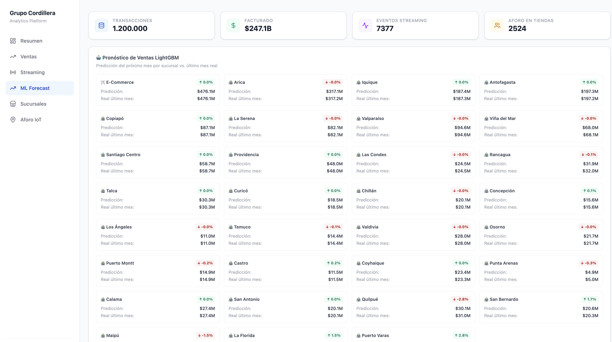

# GUÍA DE EVIDENCIAS DE IMPLEMENTACIÓN

## PROYECTO INTEGRAL DE BIG DATA — GRUPO CORDILLERA

**Asignatura:** Big Data (AVY1101) — Duoc UC

---

Este documento recopila de manera ordenada y clasificada las evidencias técnicas y de visualización del proyecto **Grupo Cordillera**. Las imágenes respaldan la configuración de infraestructura en Google Cloud Platform (GCP), los flujos de transformación analítica y las interfaces de visualización desarrolladas en Streamlit y React.

---

## 1. Capa Batch: Ingesta, Procesamiento y Almacenamiento

El pipeline batch procesa la información histórica cargando archivos CSV y JSON desde el Data Lake hacia el Data Warehouse tras una limpieza profunda de formatos y calidad.

### 1.1. Configuración de Tablas Externas (Capa Raw)
Se evidencia el dataset `grupo_cordillera_raw` en BigQuery, el cual expone los archivos crudos del Data Lake en Cloud Storage sin incurrir en costos extras de almacenamiento:

### 1.2. Limpieza de Datos con Cloud Dataprep
Receta de limpieza implementada en Cloud Dataprep para normalizar montos, estructurar fechas de venta y anonimizar datos personales de clientes antes de la carga final:

### 1.3. Esquema del Data Warehouse (Capa DW)
Estructura final de las tablas físicas y particionadas en el dataset `grupo_cordillera_dw`, preparadas para consultas de alto rendimiento y consumo de negocio:

### 1.4. Visualización Histórica Batch
Panel ejecutivo de ventas históricas (Evaluación N° 2) que muestra KPIs de facturación, participación omnicanal, embudo de conversión y tendencias mensuales:

---

## 2. Capa Speed e IoT: Procesamiento y Auditoría en Tiempo Real

La Capa Speed captura eventos web y de sensores IoT de aforo a través de Google Cloud Pub/Sub, ejecutando consumidores en Python que procesan, limpian e insertan micro-lotes directamente en BigQuery.

### 2.1. Ingesta y Persistencia en BigQuery
Vista del explorador de BigQuery evidenciando las consultas interactivas ejecutadas sobre las tablas de flujo rápido `fact_sesiones_web_streaming` y `fact_aforo_streaming`:

### 2.2. Registro de Actividad y Logs de Auditoría
Evidencia de los logs de auditoría recolectados en Google Cloud Logging, demostrando la trazabilidad de las ejecuciones de los contenedores de simulación y carga:

### 2.3. Monitoreo del Flujo Streaming en Vivo
Vista de la pestaña de monitoreo en Streamlit con indicador parpadeante en vivo, el embudo web en vuelo y el log de auditoría con enmascaramiento de direcciones IP:

---

## 3. Frontend Profesional y Analítica Avanzada (React + FastAPI)

Como interfaz de nivel de producción, se construyó una aplicación React completa que expone las métricas omnicanal, el estado geográfico de las tiendas y el pronóstico de ventas inteligente.

### 3.1. Panel de Resumen Ejecutivo (CRM React)
Pantalla principal de la aplicación React que consolida los indicadores batch de negocio con la tasa de navegación web en tiempo real:

### 3.2. Mapa Nacional de Ocupación IoT
Mapa interactivo con Leaflet que muestra las 30 sucursales físicas geolocalizadas a lo largo de Chile, con marcadores de color según el porcentaje de ocupación actual recibido por los sensores:

### 3.3. Pronóstico de Ventas con Machine Learning
Sección que muestra las predicciones de ventas para el próximo mes por sucursal, calculadas por el modelo entrenado con LightGBM y consumidas desde el API REST backend:

