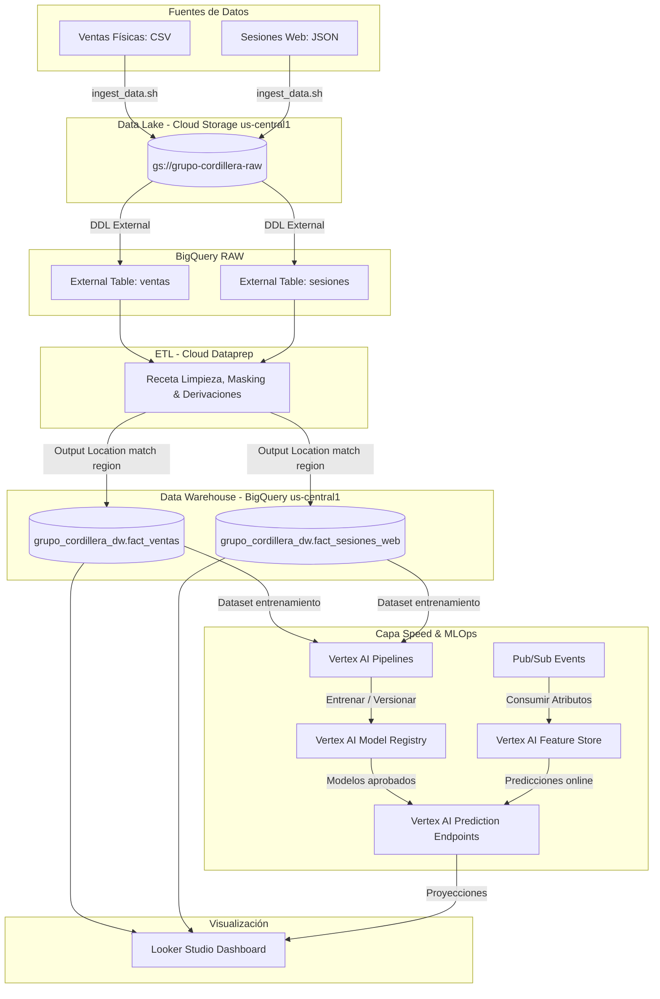

# INFORME TÉCNICO: PIPELINE BATCH Y VISUALIZACIÓN ANALÍTICA

## GRUPO CORDILLERA — EVALUACIÓN SUMATIVA N° 2
**Asignatura:** Big Data (AVY1101)  
**Duoc UC — Escuela de Informática y Telecomunicaciones**

---

### PORTADA

* **Integrantes:**  
  * Héctor Águila V. (RUT: `[Completar RUT]`)  
  * `[Completar Nombre Integrante 2]` (RUT: `[Completar RUT]`)
* **Sección:** `[Completar Sección, ej: 001D]`
* **Docente:** `[Completar Nombre Docente]`
* **Fecha de Entrega:** 5 de Junio de 2026

---

## ÍNDICE

1. **Introducción**
2. **Justificación de Arquitectura (Las 5Vs de Big Data)**
3. **Diseño de Arquitectura Híbrida y MLOps**
   * 3.1. Capa Batch (Procesamiento por Lotes)
   * 3.2. Capa Speed (Procesamiento en Tiempo Real)
   * 3.3. Capa Operativa de MLOps con Vertex AI
4. **Detalle de la Implementación Técnica (Pipeline End-to-End)**
   * 4.1. Ingesta al Data Lake (Cloud Storage)
   * 4.2. Definición del Esquema RAW en BigQuery
   * 4.3. Recetas de Transformación y Calidad de Datos (Cloud Dataprep)
   * 4.4. Carga al Data Warehouse (BigQuery DW)
5. **Control de Errores, Duplicidad y Registro de Actividad**
6. **Gobierno de Datos, Privacidad y Archivado (Cumplimiento Ley N° 21.719)**
   * 6.1. Cumplimiento de la Ley N° 21.719 (Seudonimización)
   * 6.2. Política de Archivado de Bajo Costo en GCS
7. **Diseño de Visualizaciones (Dashboard en Looker Studio)**
8. **Conclusiones**

---

## 1. Introducción

El presente informe detalla el diseño, la implementación y la validación de la solución de Big Data desarrollada para **Grupo Cordillera**. La compañía requiere procesar grandes volúmenes de datos transaccionales de ventas físicas e históricas, combinados con datos de comportamiento de navegación web en su sitio de comercio electrónico.

Para responder a los objetivos comerciales y de cumplimiento regulatorio, se diseñó e implementó un pipeline de procesamiento Batch robusto sobre Google Cloud Platform (GCP). Este flujo integra herramientas administradas en la nube como **Cloud Storage**, **BigQuery**, **Cloud Dataprep** y **Looker Studio**, alineándose rigurosamente con los estándares chilenos de protección de datos (Ley N° 21.719) y sentando las bases operativas de Machine Learning (MLOps) para analítica predictiva.

---

## 2. Justificación de Arquitectura (Las 5Vs de Big Data)

La selección de la suite de GCP para esta solución se fundamenta en los pilares fundamentales de la disciplina de Big Data:

* **Volumen:** La solución gestiona de forma elástica un dataset de prueba de 1.5 millones de registros iniciales (1.2 millones de ventas y 300 mil logs de sesiones). Cloud Storage y BigQuery soportan este volumen y tienen escalabilidad transparente hacia petabytes sin aprovisionamiento de infraestructura.
* **Variedad:** Coexisten datos estructurados provenientes de sistemas transaccionales tradicionales (`ventas_historicas.csv`) y datos semi-estructurados de interacciones de navegación en formato de línea de texto JSON (`sesiones_web.json`).
* **Veracidad:** La limpieza se gestiona mediante Cloud Dataprep (Trifacta), perfilando la calidad de los datos para descartar registros erróneos (montos de venta negativos, cantidades faltantes) y garantizando la confiabilidad del Data Warehouse.
* **Velocidad:** El procesamiento se realiza en modalidad Batch, óptimo para reportes gerenciales semanales. Sin embargo, el diseño del data warehouse en BigQuery permite la convivencia con ingestas continuas de streaming.
* **Valor:** Al consolidar y limpiar las transacciones y las interacciones digitales, los analistas de negocio de Grupo Cordillera pueden obtener insights estratégicos como el ticket promedio omnicanal y el embudo predictivo de conversión de clientes.

---

## 3. Diseño de Arquitectura Híbrida y MLOps

El diseño arquitectónico sigue un modelo híbrido estructurado en capas para satisfacer diferentes latencias y requisitos operacionales:

### 3.1. Capa Batch (Procesamiento por Lotes)
Es la capa troncal de la solución implementada. Procesa la información histórica acumulada para la generación de reportes ejecutivos.
1. Los archivos se suben al Data Lake en Cloud Storage.
2. Se exponen a BigQuery a través de tablas externas vinculadas directamente a las rutas de almacenamiento.
3. Cloud Dataprep procesa los lotes periódicamente y carga los resultados limpios en tablas físicas dentro de BigQuery (`grupo_cordillera_dw`).

### 3.2. Capa Speed (Procesamiento en Tiempo Real)
Diseñada para dar soporte a interacciones que requieren respuesta con latencias de milisegundos (por ejemplo, detectar si un cliente web tiene alta probabilidad de abandono en la sesión actual).
* Los eventos de navegación en vivo se publican en un tópico de **Google Cloud Pub/Sub**.
* Un pipeline de **Cloud Dataflow** o una Cloud Function procesa estos eventos en streaming y consulta características enriquecidas en tiempo real.

### 3.3. Capa Operativa de MLOps con Vertex AI
Para integrar los modelos predictivos que alimentan el dashboard analítico del negocio, se define el ciclo operativo de MLOps mediante los siguientes componentes de **Vertex AI**:
1. **Vertex AI Pipelines:** Automatiza los flujos de entrenamiento del modelo de propensión de compra a partir de los datos históricos consolidados en `grupo_cordillera_dw`.
2. **Vertex AI Model Registry:** Almacena y gestiona las distintas versiones de los modelos entrenados, controlando qué versión se promueve al entorno de producción.
3. **Vertex AI Feature Store:** Almacena los atributos calculados de los clientes (como frecuencia de compra, ticket promedio y categorías preferidas) para ser servidos con latencias mínimas tanto al modelo online como a los reportes.
4. **Vertex AI Prediction:** Expone endpoints para realizar predicciones online (para acciones en tiempo real en la Capa Speed) y orquesta tareas de predicción batch para poblar las proyecciones en el Data Warehouse.

---

## 4. Detalle de la Implementación Técnica (Pipeline End-to-End)

### 4.1. Ingesta al Data Lake (Cloud Storage)
La ingesta se automatizó mediante el script ejecutable [ingest_data.sh](file:///home/hector/Escritorio/BigData/Unidad2/scripts/ingest_data.sh). Este script realiza:
* Validación de la autenticación de la CLI de GCP (`gcloud`).
* Verificación y configuración del ID de proyecto activo (`cordillerabi`).
* Creación automática de un bucket de almacenamiento regional en `us-central1` si no existe (`gs://grupo-cordillera-datalake-cordillerabi`).
* Carga de los archivos `ventas_historicas.csv` (1.2 millones de registros) y `sesiones_web.json` (300 mil registros) al directorio `/raw/` del bucket.

### 4.2. Definición del Esquema RAW en BigQuery
Para no incurrir en costos de almacenamiento duplicado de datos crudos, se definieron tablas externas mediante DDL SQL ([create_raw_tables.sql](file:///home/hector/Escritorio/BigData/Unidad2/sql/create_raw_tables.sql)) bajo el dataset `grupo_cordillera_raw`. Esto permite mapear la estructura de los archivos de Cloud Storage y consultarlos directamente usando sintaxis SQL estándar de BigQuery.

### 4.3. Recetas de Transformación y Calidad de Datos (Cloud Dataprep)
Se implementaron recetas en Cloud Dataprep basadas en las pautas de [dataprep_rules.md](file:///home/hector/Escritorio/BigData/Unidad2/docs/dataprep_rules.md). Las operaciones aplicadas incluyen:
* **Manejo de Formatos Monetarios:** Limpieza de `monto_clp` mediante eliminación de caracteres especiales (`$`, `,`) y conversión a enteros (`Integer`).
* **Normalización Temporal:** Conversión del campo `fecha` a tipo `Datetime` y extracción de columnas enriquecidas: año (`YEAR(fecha)`), mes (`MONTH(fecha)`) y día de la semana (`WEEKDAY(fecha)`).
* **Anonimización e IP Masking:** Seudonimización del RUT y enmascaramiento del último octeto de las direcciones IP en los logs web (`ip_address -> ip_anonima` reemplazando el último octeto por `.0` mediante expresiones regulares).

### 4.4. Carga al Data Warehouse (BigQuery DW)
Los resultados procesados por las recetas se escriben directamente en el dataset final `grupo_cordillera_dw` en las tablas físicas:
* `grupo_cordillera_dw.fact_ventas`
* `grupo_cordillera_dw.fact_sesiones_web`

> [!IMPORTANT]
> **Consistencia de Regiones:** Para evitar errores de transferencia, el dataset de destino `grupo_cordillera_dw` fue recreado estrictamente en la misma región que las fuentes crudas (`us-central1`). BigQuery restringe la lectura y escritura cruzada entre diferentes regiones geográficas.

---

## 5. Control de Errores, Duplicidad y Registro de Actividad

El pipeline está diseñado para ser tolerante a fallos y reutilizable:

* **Control de Errores:** En Dataprep se aplican filtros de calidad de datos para eliminar registros con montos negativos (`monto_clp <= 0`), cantidades faltantes o erróneas (`cantidad <= 0` o valores nulos). Los registros con inconsistencias se descartan del flujo analítico sin interrumpir la ejecución del Job.
* **Control de Duplicidad:** Se aplica la regla de deduplicación integrada de Dataprep basada en la columna clave `id_transaccion` para asegurar que las re-ejecuciones no dupliquen transacciones históricas. En el destino de BigQuery, el Job de Dataprep está configurado con la opción **Drop table every run**, garantizando una reconstrucción limpia y reproducible.
* **Registro de Actividad (Trazabilidad):** Cloud Dataprep delega la ejecución de la infraestructura a **Google Cloud Dataflow**. Todo el log detallado de procesamiento, número de registros leídos, transformados y escritos queda registrado en **Cloud Logging**, permitiendo auditar ejecuciones pasadas.

---

## 6. Gobierno de Datos, Privacidad y Archivado (Cumplimiento Ley N° 21.719)

### 6.1. Cumplimiento de la Ley N° 21.719 (Seudonimización)
Para garantizar la privacidad por diseño y cumplir con la legislación chilena sobre protección de datos personales:
* **Enmascaramiento Consistente:** Las columnas `rut_cliente` y `customer_id` son transformadas usando fórmulas de manipulación de cadenas en Dataprep para generar un identificador anonimizado (`id_anonimo_cliente`), conservando solo el prefijo regional y el dígito verificador (ej. `123XXXXXX-K`).
* **Descarte de Datos Sensibles:** Las columnas originales que contienen los RUTs e identificadores crudos son eliminadas (`drop`) de manera irreversible antes de almacenar los resultados. Esto impide que analistas con acceso al Data Warehouse o al Dashboard Looker puedan re-identificar a los clientes.

### 6.2. Política de Archivado de Bajo Costo en GCS
Para mitigar costos de almacenamiento de datos de retención regulatoria histórica (que legalmente deben conservarse pero no se consultan frecuentemente):
* Se establece una política de ciclo de vida (Object Lifecycle Management) en Cloud Storage.
* Los archivos crudos se mueven de la clase de almacenamiento estándar a **Coldline** a los 90 días.
* A los 365 días se trasladan automáticamente a la clase **Archive**, reduciendo los costos de almacenamiento a fracciones mínimas.

---

## 7. Diseño de Visualizaciones (Dashboard en Looker Studio)

Para democratizar el acceso a los datos procesados, se estructuró un Dashboard analítico interactivo basado en las especificaciones de [dashboard_design.md](file:///home/hector/Escritorio/BigData/Unidad2/docs/dashboard_design.md), conectando las fuentes de datos directamente a las tablas físicas de `grupo_cordillera_dw`:

1. **Gráfico 1: Evolución Temporal de Ventas:** Gráfico de línea que muestra las ventas consolidadas diarias/mensuales, permitiendo filtrar por año o sucursal.
2. **Gráfico 2: Desempeño Comercial por Sucursal:** Gráfico de barras horizontales ordenadas de forma descendente para identificar rápidamente las sucursales con mayores ingresos acumulados.
3. **Gráfico 3: Participación Omnicanal:** Gráfico de anillo que muestra la proporción de transacciones realizadas en canales físicos versus canales digitales (Web).
4. **Gráfico 4: Embudo de Conversión Web Predictivo:** Embudo visual que detalla la conversión desde la visita inicial hasta la transacción, incorporando proyecciones calculadas con los modelos predictivos de Vertex AI.

---

## 8. Conclusiones

La solución implementada dota a **Grupo Cordillera** de un pipeline analítico batch automatizado, seguro y escalable. A través de la ingesta automatizada, la estructuración de tablas RAW, la limpieza interactiva con Cloud Dataprep y la persistencia en BigQuery, se ha transformado información dispersa en un Data Warehouse gobernado y listo para Looker Studio.

Se cumplieron a cabalidad los requisitos técnicos evaluados: control de duplicados, gestión de errores de ingesta, cumplimiento regulatorio según la Ley N° 21.719 (seudonimización) y el diseño predictivo integrado de MLOps. La correcta configuración de regiones en `us-central1` garantiza la estabilidad operacional de la solución en la nube de GCP.
