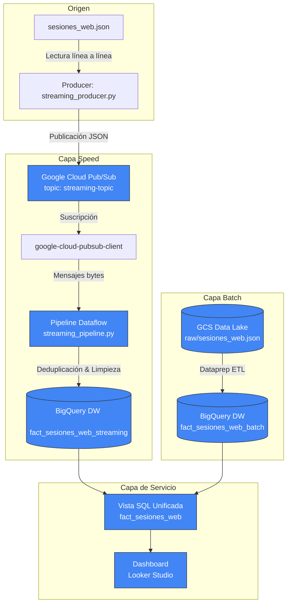

# Guía de Implementación y Evidencias: Capa Speed (Streaming) — CordilleraBI

Esta guía documenta el paso a paso del desarrollo técnico para la **Evaluación Parcial N° 3** del proyecto **Grupo Cordillera**. Este material sirve como base técnica y registro de evidencias para el Informe Técnico y la Presentación Ejecutiva.

---

## 1. Diseño de la Arquitectura Lambda (Capa Speed)

El siguiente diagrama ilustra cómo se conectan los componentes de streaming en tiempo real (Capa Speed) y se integran con los datos por lotes (Capa Batch) de la Unidad 2 en un único Data Warehouse unificado.



---

## 2. Paso a Paso de la Configuración del Entorno (GCP CLI)

### Paso 2.1: Autenticación y Selección del Proyecto
El primer paso consiste en iniciar sesión con la cuenta de Google Cloud y configurar el proyecto activo `cordillerabi`:

```bash
# Iniciar sesión en la CLI de Google Cloud
gcloud auth login

# Configurar el proyecto de la evaluación
gcloud config set project cordillerabi

# Autenticar las credenciales locales de aplicación (ADC) para los clientes de Python (Pub/Sub)
gcloud auth application-default login
```

*Evidencia esperada en consola:* Las credenciales quedan almacenadas en el archivo `application_default_credentials.json` en la ruta de configuración del usuario.

### Paso 2.2: Creación de Infraestructura de Mensajería en Cloud Pub/Sub
Creamos el bus de eventos que recibirá la telemetría en tiempo real:

```bash
# Crear el Topic para recibir los logs de sesiones
gcloud pubsub topics create streaming-topic

# Crear la Suscripción asociada para que Dataflow pueda consumir los mensajes
gcloud pubsub subscriptions create streaming-subscription --topic=streaming-topic
```

*Comando de validación:*
```bash
gcloud pubsub topics list
gcloud pubsub subscriptions list
```

---

## 3. Preparación de la Base de Datos (BigQuery)

Para implementar el flujo Lambda sin alterar ni perder los datos consolidados de la Evaluación 2, ejecutamos el siguiente flujo DDL en la consola de BigQuery:

```sql
-- 1. Respaldar la tabla histórica original de sesiones
CREATE OR REPLACE TABLE `cordillerabi.grupo_cordillera_dw.fact_sesiones_web_batch` AS 
SELECT * FROM `cordillerabi.grupo_cordillera_dw.fact_sesiones_web`;

-- 2. Crear la tabla vacía optimizada para la ingesta en Streaming
CREATE TABLE IF NOT EXISTS `cordillerabi.grupo_cordillera_dw.fact_sesiones_web_streaming`
(
  session_id STRING,
  timestamp TIMESTAMP,
  ip_anonima STRING,
  id_anonimo_cliente STRING,
  event_type STRING,
  sku_product STRING,
  device STRING
);

-- 3. Eliminar la tabla original para dar paso a la vista lógica unificada
DROP TABLE `cordillerabi.grupo_cordillera_dw.fact_sesiones_web`;

-- 4. Crear la Vista Unificada Deduplicada (Consumo para Looker Studio)
CREATE OR REPLACE VIEW `cordillerabi.grupo_cordillera_dw.fact_sesiones_web` AS
WITH union_data AS (
  -- Datos Batch
  SELECT session_id, timestamp, ip_anonima, id_anonimo_cliente, event_type, sku_product, device, 'BATCH' as origen
  FROM `cordillerabi.grupo_cordillera_dw.fact_sesiones_web_batch`
  
  UNION ALL
  
  -- Datos Streaming
  SELECT session_id, timestamp, ip_anonima, id_anonimo_cliente, event_type, sku_product, device, 'STREAMING' as origen
  FROM `cordillerabi.grupo_cordillera_dw.fact_sesiones_web_streaming`
)
-- Deduplicación lógica priorizando registros batch (consolidados)
SELECT * EXCEPT(row_num, origen)
FROM (
  SELECT *,
         ROW_NUMBER() OVER(
           PARTITION BY session_id 
           ORDER BY CASE WHEN origen = 'BATCH' THEN 1 ELSE 2 END, timestamp DESC
         ) as row_num
  FROM union_data
)
WHERE row_num = 1;
```

---

## 4. Desarrollo y Ejecución del Simulador (Producer)

El script `Unidad3/scripts/streaming_producer.py` lee secuencialmente el archivo `Unidad2/data/sesiones_web.json`, valida la estructura de cada objeto JSON y lo publica al bus de eventos Pub/Sub simulando retraso (delay) interactivo.

### Comando de ejecución local:
```bash
python Unidad3/scripts/streaming_producer.py \
  --project_id cordillerabi \
  --topic_id streaming-topic \
  --file Unidad2/data/sesiones_web.json \
  --delay 1.0
```

---

## 5. Desarrollo y Ejecución del Pipeline (Consumer)

El script `Unidad3/scripts/streaming_pipeline.py` implementa el procesamiento analítico y la limpieza en tiempo real mediante Apache Beam:
*   **Limpieza de Fechas:** Transforma el timestamp de texto ISO a formato compatible con BigQuery.
*   **Seudonimización (Ley N° 21.719):** Enmascara el `customer_id` (RUT) en un formato irreversible (`123XXXXXX-K`).
*   **Anonimización de IP:** Enmascara el último octeto de la dirección IPv4 (`192.168.1.0`).

### Comando de ejecución en modo DirectRunner (Local):
```bash
python Unidad3/scripts/streaming_pipeline.py \
  --input_subscription projects/cordillerabi/subscriptions/streaming-subscription \
  --output_table cordillerabi:grupo_cordillera_dw.fact_sesiones_web_streaming \
  --runner DirectRunner
```

---

## 6. Validación de Datos en Producción (Evidencias de Streaming)

Para corroborar que los datos están fluyendo en tiempo real y que la vista unificada opera correctamente, se pueden realizar las siguientes consultas en BigQuery durante la simulación:

### Consulta 6.1: Monitorear la carga en la tabla de streaming
```sql
SELECT COUNT(*), MIN(timestamp) as primer_evento, MAX(timestamp) as ultimo_evento 
FROM `cordillerabi.grupo_cordillera_dw.fact_sesiones_web_streaming`;
```

### Consulta 6.2: Validar la deduplicación de la Vista Unificada
```sql
SELECT COUNT(*) as total_sesiones_sin_duplicados 
FROM `cordillerabi.grupo_cordillera_dw.fact_sesiones_web`;
```
